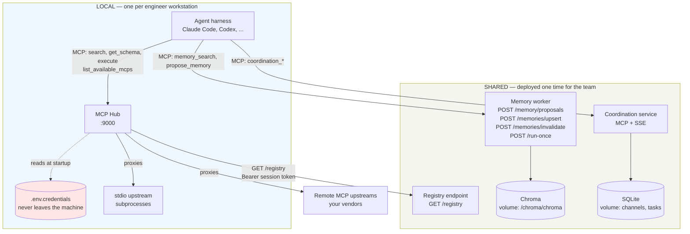

# Wagglebot Design Spec

> **Related specs:**
> - [Service contracts](2026-08-28-service-contracts.md) — behavior
>   contracts for the hub and the memory worker. The pitfall register
>   (P-numbers) is also there.
> - [Cross-machine collaboration](2026-08-28-cross-machine-collaboration-design.md)
>   — the Phase 2 coordination service.
> - [Workstation provisioning](2026-08-28-provisioning-design.md) —
>   the curated skill list and the shared agent base template.
> - [Descoped ideas](2026-08-28-descoped-ideas.md) — what we removed
>   from the MVP, and what would bring it back.
> - [Research list](2026-08-28-research-list.md) — ideas that need
>   study before a decision.

## Problem

Each AI agent that connects to company tools needs the same
infrastructure. This infrastructure includes an MCP aggregation layer,
durable memory, and a way to give every engineer the same skills and
instructions. Teams usually build this wiring in company-specific
monorepos. Vendor services are hardcoded into the config layer of those
monorepos.

We want a **reusable framework** that each team can clone, configure,
and deploy. No team must fork the internals of a different company.

## Goals

1. **MCP Hub** — One `/mcp` endpoint that proxies requests to any number
   of upstream MCP servers. The hub has zero hardcoded upstreams. A
   user-supplied JSON config defines the full surface.
2. **Durable Memory** — An async pipeline that accepts structured facts.
   The agent extracts them, so no model runs on the write path (D24).
   The pipeline scans each write for credentials, deduplicates it, and
   stores it as a vector embedding for later retrieval.
3. **Agent Environment Provisioning** — Shared tooling that installs a
   curated skill set. The same tooling distributes one base instruction
   template across every agent harness on a workstation.
4. **Cross-Machine Collaboration** (Phase 2) — A coordination layer for
   agents on different machines. Agents discover each other, share
   memory, and hand off tasks. The scope is the system and branch of
   their humans.
5. **Runtime-Agnostic** — The framework services (hub, memory,
   coordination) run as standalone Docker containers. Any agent runtime
   (LangGraph, raw LLM loops, Claude Code) connects over HTTP/MCP.
6. **Deployment-Agnostic** — Wagglebot ships Docker images and a
   compose file, nothing else. The stack runs the same on a laptop, a
   self-hosted box, or any container platform. Development needs no
   cloud accounts. The optional batch extractor runs on a CPU (D2, D25).

## Non-Goals

- A specific agent runtime or LLM wrapper.
- Hardcoded support for any SaaS vendor. Users supply those as upstream
  MCP configs.
- A managed cloud platform or a billing layer.
- **Deployment tooling** (Terraform, Helm, cloud-specific IaC). The
  contract ends at containers with documented env vars and health
  endpoints. The operator selects where to run them.
- **Event-triggered agent flows** (a Sentry error or a Slack mention
  that starts an agent). A local agent with an MCP server already does
  this, under supervision. See the
  [descoped ideas](2026-08-28-descoped-ideas.md).

---

## Decisions

| # | Decision |
|---|---|
| D1 | The full stack is **TypeScript (Bun)**. The hub is built on `@modelcontextprotocol/sdk`. |
| D2 | **An extractor serves document ingestion only, never the session path (D24).** When a deployment enables the batch mode, the extractor uses **OpenAI-compatible HTTP only**. It does not load models in-process. The optional compose profile ships a `llama.cpp` server container with a small Qwen GGUF (~1.1 GB, CPU-friendly). A remote endpoint needs only a different `EXTRACTOR_API_BASE` value, no code change. |
| D3 | There is **no MCP wrapper service in front of Chroma**. The memory worker uses the official Chroma JS client. The memory worker also exposes a first-party MCP surface for search and proposals. The hub registers that surface like any upstream (guards P17). |
| D4 | Coordination runs as a **standalone container**. The hub registers it via `registry.yaml` like any other upstream. It never embeds in the hub. |
| D5 | (Phase 2) Task board: **FIFO claiming with an optional integer `priority`** (default 0, order `priority DESC, created_at ASC`). No deadlines, no scheduler. Each claim carries a **lease with a heartbeat and a monotonic fencing token**. An expired lease returns the task to the board. Delivery is **at-least-once**: completion requires the current fence, and external effects deduplicate on an idempotency key. |
| D6 | Messages are **persistent with replay**: an append-only log, cursor-based replay over SSE (`Last-Event-ID`), a 7-day TTL, and a SQLite store. |
| D7 | **Auth is fail-closed everywhere.** Each service requires a bearer token when one is configured. A network-exposed service refuses to start without one. One env name pattern applies: `<SERVICE>_BEARER_TOKEN` on the server, and the same name on clients (guards P2, P3, P11). |
| D8 | **One health convention:** `GET /livez` is shallow, always 200, and auth-exempt (process liveness). `GET /readyz` reports dependency and startup state, and returns 503 when the service cannot serve. Point load balancers at `/readyz`. |
| D9 | **The hub always runs local, on the engineer workstation.** The shared layer holds **no engineer credentials and no upstream MCP credentials**, and it never calls an upstream MCP server. It does hold its own service bearer tokens, which need normal secret storage and rotation. |
| D10 | **The config splits in two.** The shared registry declares each upstream and names its credential. It stores no secret. The local hub resolves each credential from the workstation. A team-wide token uses the same mechanism, with different distribution. |
| D12 | **People connect by username, never by address.** Each engineer registers with the company username (SSO name). All agent traffic flows outbound through the shared coordination service. A direct connection between two people requires an approval: the receiver sees who asks and accepts or rejects. No VPN, tunnel, or IP exchange exists in this design. |
| D13 | **Every executable dependency is pinned.** `stdio_npx` packages carry exact versions, container images pin digests, and `skills.list` pins revisions. Nothing installs `latest`. |
| D14 | **Phase 1 ships three things: the MCP hub, shared memory, and provisioning.** Each one is useful while an engineer works, and none is possible without a shared layer. The task board, presence, messaging, and collaboration stay Phase 2, because each needs two agents running at one time. |
| D15 | **Trusted coworkers.** Every registered engineer is trusted. Identity serves routing, context, and attribution. Teams and scopes never deny an operation between registered users. Git and the company identity provider control code access. Only impersonation protection and operator actions stay restricted (P34). |
| D16 | **The catalog uses the full Backstage entity model.** Component (one repository or subtree) sits in a System (one project), which sits in a Domain (a business area). A Group owns each entity, with `parent` for subteams. Ownership stays separate from grouping, so a reorganization edits one `owner` field. A branch is context, never identity (P33). |
| D19 | **Embeddings use the Chroma built-in default** (`all-MiniLM-L6-v2`, 384 dimensions, cosine distance). No second model service, no extra container, no GPU. Chroma persists the embedding function in the collection configuration, so every deployment stays consistent. Each collection still records the provider, the model, the dimension, the distance function, and a schema version, because a later model change needs a full re-embed. |
| D20 | **Catalog files use Backstage YAML.** The central `catalog.yaml` holds Domain, System, and Group entities. Each repository declares its components in `catalog-info.yaml`, or in `.wagglebot/catalog.yaml` with the identical schema. An organization already running Backstage points wagglebot at its existing files. Wagglebot never infers from a Git remote. An undeclared repository gets no system scope, and an unknown value is a hard error. |
| D21 | **Memory scopes follow the catalog: `component`, `system`, `domain`, `org`.** One scope exists per catalog level. A search reads component, then system, then domain, then organization. |
| D22 | **Agent writes default to `component`, with confirmed promotion to `system`.** The agent classifies each memory. A system classification is a proposal: the interactive agent asks its engineer in session. A background process never asks. A timeout or an uncertain classification falls back to `component`. A fact can land too low, never too high. |
| D23 | **Writes to `domain` and `org` are gated by the catalog.** A `domain` write requires membership in the owner group of that Domain. An `org` write requires the org-owner annotation on the User entity. Several users may carry the flag. Group membership lives only in the catalog. The gate restricts publication, never collaboration (D15). |
| D24 | **The agent extracts its own session memory.** It sends finished facts, never a transcript. The agent already holds the session context, and it is a stronger model than any bundled extractor. No model runs on the session write path, so the extractor stops being a bottleneck. The server still owns what a client must not: secret scrubbing, canonicalization, deduplication by content hash, embedding, and storage. A client is never a security boundary. |
| D25 | **Document ingestion is a separate pipeline with a pluggable extract step.** A human names a source, for example a Confluence page. The pipeline fetches the content through an MCP tool, extracts facts, and writes them to a named scope. Two extract modes exist: `agent` (the default, and no extra container) and `local_llm` (an opt-in batch mode for bulk volume, D2). Ingestion inherits the authorization of its caller, so a write to `domain` still requires the owner group (D23). |
| D26 | **Authentication uses an SSH public key challenge, not a distributed token.** The agent signs a server nonce with the existing SSH key of the engineer, and receives a short-lived session token. The default key source is the `wagglebot.dev/ssh-key` annotation on the User entity in the catalog, added by pull request. That works with every Git host, including Bitbucket Server. An optional `github` source fetches `<host>/<username>.keys` instead. No token needs delivery or rotation, and `users.yaml` therefore does not exist: identity lives in the catalog. |
| D27 | **The validation command rejects every duplicate.** Two entities of one kind sharing a name, a component naming an unknown system, and two channel routes matching one event are all hard errors. The message names the file and the value. Wagglebot never picks a winner silently (P35). |
| D28 | **Every memory write passes a credential scan.** Two layers run server-side: a **gitleaks** rule scan for known provider formats, and the entropy check for the formats no rule set knows. A match is redacted, and a mostly-matching write is rejected. The error names the rule, never the content. `wagglebot rescan` re-applies current rules to stored memory, because new rules arrive after old writes. Memory outlives logs, so a credential stored here would surface for years. |
| D29 | **Component memory is a local Markdown file, not a vector record.** The agent writes `.wagglebot/memory.md` in the repository. Git already distributes a file inside one repository, a pull request reviews each change, and the history is free. The shared store therefore holds only what crosses a repository boundary: `system`, `domain`, and `org`. A search still reads the local file first, then the three shared scopes. |
| D30 | **A human can commit a memory directly, with `remember`.** The MCP tool `remember({ text, scope })` and the command `wagglebot remember` write one fact to a named scope. This path is explicit, so the agent never judges the importance and never asks for a promotion confirmation (D22). The named scope still needs authorization (D23), the text still passes the credential scan (D28), and a `component` scope still writes the local file (D29). The matching `forget` tool invalidates a record the same way. |

### Why D9 and D10 matter

The MCP specification makes the hub two things at once. The hub is a
resource server to the agent. The hub is also an OAuth client to each
upstream. The specification forbids a hub from forwarding the token of
its caller:

> MCP servers **MUST** validate that access tokens were issued
> specifically for them as the intended audience. [...] MCP servers
> **MUST NOT** accept or transit any other tokens.

A shared hub that proxies for many engineers must therefore hold a
separate credential for each engineer and each upstream. That design
needs a credential store, OAuth refresh, and a consent flow inside a
container.

D9 removes the whole problem. A local hub uses one identity: the
identity of its engineer. Upstream audit logs then name a real person.
Rate limits apply per person. No engineer secret reaches the shared
layer.

D9 limits the damage of a shared layer compromise. D9 does **not** make
the registry harmless: a registry selects commands and credential names,
so the hub applies a local trust policy to every remote registry
([contracts §C2](2026-08-28-service-contracts.md#c2-mcp-hub-contract),
P29).

---

## Architecture

### Two Layers

Wagglebot uses two layers. The split follows one rule: **credentials
stay on the workstation.**

| Layer | Runs where | Holds |
|---|---|---|
| **Local** | Each engineer workstation | The MCP hub, the engineer credentials, the stdio upstream subprocesses, the skills, and the base prompt |
| **Shared** | Deployed one time for the team | The registry, memory, and (Phase 2) coordination |

A solo engineer runs both layers on one machine. The compose profiles
support that without a change (see the compose section).

### Interfaces At A Glance

Most of the surface is MCP tools, not HTTP. Six HTTP endpoints exist.



Read the diagram by following the arrows out of the agent. The agent
talks to three things, and always by MCP. Credentials touch one box.

| Surface | Kind | Who calls it |
|---|---|---|
| `search`, `get_schema`, `execute` | MCP tool | The agent, for every upstream tool |
| `list_available_mcps` | MCP tool | The agent, to see live namespaces |
| `memory_search` | MCP tool | The agent |
| `propose_memory` | MCP tool | The agent, from its own judgment (D24) |
| `remember`, `forget` | MCP tool | **You**, by telling the agent (D30) |
| `ingest_document` | MCP tool | You, to pull a page into memory (D25) |
| `coordination_*` (six tools) | MCP tool | The agent (Phase 2, task board Phase 1) |
| `GET /registry` | HTTP | The hub only, never the agent |
| `POST /memory/proposals` | HTTP | The memory MCP surface, internally |
| `POST /memories/upsert`, `/memories/invalidate` | HTTP | Humans and `wagglebot publish` (D23) |
| `POST /run-once` | HTTP | An operator, to drain the queue |
| `GET /livez`, `GET /readyz` | HTTP | The container runtime |

### Component Map

```
  LOCAL (per engineer workstation)      SHARED (deployed one time)
 ┌──────────────────────────────┐      ┌────────────────────────────┐
 │  Agent (any runtime)         │      │  registry (+ tool_catalog) │
 │      │ MCP_HUB_URL           │◄─────│  registry.yaml — NO secrets│
 │      ▼                       │ pull └────────────────────────────┘
 │  mcp-hub :9000               │      ┌────────────────────────────┐
 │  + engineer credentials      │─────▶│  memory-worker :3011       │
 │      │                       │ MCP  │    │ chroma-db :8000       │
 │      ├──────────────┐        │      │    └ extractor (optional)  │
 │      ▼              ▼        │      └────────────────────────────┘
 │  stdio MCP     remote MCP    │      ┌────────────────────────────┐
 │  subprocesses  upstreams     │─────▶│  coordination :3020 (Ph. 2)│
 └──────────────────────────────┘ MCP  │  presence · log · tasks    │
                                       └────────────────────────────┘
```

The shared layer never calls an upstream MCP server. Only the local hub
does that.

### 1. MCP Hub (local layer)

A TypeScript service on `@modelcontextprotocol/sdk`. It runs on the
engineer workstation (D9). The
[service contracts](2026-08-28-service-contracts.md) give the details.

- Four proxy modes: `remote_http`, `remote_sse`, `stdio_npx`,
  `stdio_cmd`.
- Config comes from `MCP_HUB_CONFIG_PATH` or `MCP_HUB_CONFIG_URL`. The
  URL form pulls the shared catalog. There are no env-derived vendor
  defaults and no unconditional proxies.
- Each upstream declares an auth **scheme** and a credential **source**
  (D10). The catalog carries both, but never a secret value. The hub
  resolves each value locally, from an environment variable or a file.
- A missing credential skips that namespace. The hub logs one clear line
  and continues. A missing credential never aborts startup.
- The hub injects the resolved credential. It **strips the inbound
  `Authorization` header** first. Caller credentials never travel
  downstream, as the MCP specification requires.
- A tool cache with warmup and adaptive background refresh. A failed
  fetch keeps the last good cache.
- A CodeMode-style transform. The client sees only `search`,
  `get_schema`, `execute`, and the introspection tools. The client never
  sees the full downstream tool surface. This transform is the decision
  that makes the hub scale.
- Introspection tools: `list_available_mcps`, `get_tool_catalog`,
  `recommend_tool_families`, `get_usage_guide`. The operator supplies
  the catalog file (`MCP_HUB_TOOL_CATALOG_PATH`). Wagglebot ships an
  empty example, never vendor content.
- Startup gating: the hub registers unreachable remote upstreams and
  heals them with background refresh. A missing stdio binary aborts
  startup. `MCP_HUB_STARTUP_STRICT=1` also aborts on unreachable
  remotes.
- Log redaction: keyed token fingerprints (contracts §C2), sanitized
  endpoints, and argument key names only. Values are never logged.

The CodeMode transform is the most difficult part. Plan its
implementation explicitly.

### 2. Memory Worker (shared layer)

TypeScript/Bun. The team deploys one instance. Each local hub registers
it as an upstream, so agents reach memory through their own hub.

- **No model on the session write path (D24).** The agent sends
  finished facts. The worker never re-reads a transcript.
- **Server-side duties, because a client is not a security boundary:**
  secret scrubbing, canonicalization, deduplication by content hash,
  embedding, and storage. The worker runs these on every write,
  whatever the source.
- **Document ingestion (D25):** a separate pipeline. It fetches a named
  source through an MCP tool, extracts facts, and writes them to a
  named scope. The extract step is pluggable: `agent` by default, and
  `local_llm` for the opt-in batch mode. The batch mode uses an
  OpenAI-compatible HTTP client (D2). Env: `EXTRACTOR_API_BASE`,
  `EXTRACTOR_API_KEY` (optional), `EXTRACTOR_MODEL`. The worker parses
  each completion defensively. A non-JSON completion fails the job into
  the normal retry path.
- **Storage:** Chroma via the official JS client (D3). Collection
  routing, tombstone and supersede conventions, and preflight dedup
  follow contracts §C3.
- **Auth:** an SSH key challenge issues a session token (D26). Every
  request then carries that token.
- **API:** `POST /memory/proposals` (agents), `POST /memories/upsert`
  and `POST /memories/invalidate` (humans and the publication command,
  gated by the catalog per D23), `POST /run-once`, `GET /livez`, and
  `GET /readyz`. An MCP surface adds `memory_search`, `memory_query`,
  `propose_memory`, `remember`, `forget`, and `ingest_document`. Agents
  reach memory through the hub.
- **Queue:** a filesystem state machine (atomic rename claim,
  `queued/running/done/failed`, 3 attempts). Garbage collection removes
  old entries from `done/` and `failed/`. Session writes pass through
  quickly, because no model call blocks them.
- **Concurrency:** exactly one worker instance per storage root. The
  manifest files are read-modify-write under an in-process lock (P4).
  Document this limit. Move the manifests to SQLite only when scale
  demands it.
- **Memory rules live in the base prompt, not in a server policy file
  (D24).** The agent decides what deserves memory, so the rules must
  reach the agent. `AGENTS.base.md` carries them.
- **Persistence:** named Docker volumes hold Chroma (`/chroma/chroma`)
  and the coordination SQLite file. A volume survives a restart, but
  not a disk loss or a bad migration. The stack therefore ships `dump`
  and `restore` commands for both stores.

### 3. Component Memory Is A Local File (D29)

Not every memory belongs on a server. A fact about one repository
belongs **in** that repository:

```
.wagglebot/memory.md
```

Git already distributes that file to everyone who clones the
repository. A pull request reviews each change, and the history is
free. A server adds nothing.

The shared store therefore holds only what crosses a repository
boundary:

| Scope | Where it lives |
|---|---|
| `component` | `.wagglebot/memory.md`, in the repository |
| `system`, `domain`, `org` | The shared memory worker |

A search reads the local file first, then the three shared scopes.

This also makes the common case reviewable. A pull request that says
"the agent wants to remember this" beats a silent write into a vector
store.

NOTE: The superpowers skill set already works this way. It writes specs
and plans into `docs/superpowers/specs/`, in git. Component memory
follows the same pattern.

### 4. How The Agent Knows Which Upstream To Use

The agent never reads the shared registry. The agent talks only to its
local hub. Two centrally curated files answer the question, and the hub
serves both.

| File | Answers | Shared | Secrets |
|---|---|---|---|
| `registry.yaml` | Which upstreams exist, and how to reach and authenticate each one | Yes | No. It names each credential only. |
| `tool_catalog.yaml` | When to use each family, and what to avoid | Yes | No |

The startup sequence:

1. The hub pulls `registry.yaml` from `MCP_HUB_CONFIG_URL`.
2. The hub resolves each credential locally. It skips any upstream with
   a missing credential.
3. The hub connects to each remaining upstream. It caches the tool
   schemas.
4. The agent connects to the hub. It sees `search`, `get_schema`,
   `execute`, and the introspection tools.

At run time the agent calls `search` for a capability. The hub answers
from its cached schemas. The agent calls `recommend_tool_families` for
routing advice. The hub answers from `tool_catalog.yaml`.

The team therefore curates both the upstream list **and** the routing
advice one time. Each engineer receives both. The remote origin of the
files stays invisible to the agent.

The hub re-pulls the registry on the interval
`MCP_HUB_CONFIG_REFRESH_SECONDS`. Tool schemas refresh on the existing
background cycle.

### 5. Coordination (Phase 2)

A standalone MCP + SSE service, scoped by system and branch.

All of it is Phase 2 (D14), because every part needs two agents
running at one time: the task board, presence, messaging, and username
connections with approval (D12).

The
[cross-machine collaboration spec](2026-08-28-cross-machine-collaboration-design.md)
has the full design, including the central files and the trusted
coworker model (D15).

---

## Repository Structure

```
wagglebot/
├── services/
│   ├── mcp-hub/                 # MCP aggregation proxy (TypeScript/Bun)
│   ├── memory-worker/           # Durable memory pipeline (TypeScript/Bun)
│   └── coordination/            # Presence, messaging, tasks (Phase 2)
├── central/                     # Operator-maintained, versioned
│   ├── catalog.yaml             # domains, systems, groups, users (+ssh keys)
│   ├── registry.base.yaml
│   └── registry.team.<team>.yaml
├── packages/
│   └── types/                   # Shared types (MemoryProvider, JobSpec, ...)
├── provisioning/
│   ├── skills.list              # Curated skill packages
│   ├── bin/install-skills
│   ├── bin/sync-agents
│   └── templates/
│       ├── AGENTS.base.md       # Shared agent base template
│       └── hooks/               # Per-harness hook fragments
├── templates/
│   └── starter/                 # Scaffold for new projects
│       ├── agent/               # Skeleton agent (connects to hub)
│       ├── registry.yaml        # Empty upstream registry with examples
│       ├── tool_catalog.yaml    # Empty routing guide with one example family
│       └── docker-compose.override.yml
├── models/                      # GGUF cache (gitignored, documented)
├── docker-compose.yml           # Both profiles: local and shared
├── .env.example
└── README.md
```

---

## Docker Compose — Two Profiles

One compose file carries both layers. The `local` profile runs on each
workstation. The `shared` profile runs one time for the team. A solo
engineer starts both profiles on one machine.

NOTE: The block below is **schematic**. It omits the registry serving
and bind-address
hardening. The implemented compose file must start with documented
inputs and must satisfy D7 and D8.

```yaml
services:
  # ── local profile: runs on each engineer workstation ──────────────
  mcp-hub:
    build: ./services/mcp-hub
    profiles: [local]
    environment:
      MCP_HUB_PORT: 9000
      MCP_HUB_BEARER_TOKEN: ${MCP_HUB_BEARER_TOKEN}
      MCP_HUB_CONFIG_URL: ${REGISTRY_URL:-}          # shared registry
      MCP_HUB_CONFIG_PATH: /config/registry.yaml     # fallback
      # Upstream credentials arrive as env vars named by the registry.
      # They stay on this machine.
    env_file:
      - .env.credentials       # gitignored, per engineer
    volumes:
      - ./registry.yaml:/config/registry.yaml:ro
    ports: ["9000:9000"]

  # ── shared profile: deployed one time for the team ────────────────
  chroma-db:
    image: chromadb/chroma@sha256:<pinned-digest>   # never :latest (D13)
    profiles: [shared]
    ports: ["18000:8000"]

  extractor-llm:                   # optional, batch ingestion only (D2, D25)
    image: ghcr.io/ggml-org/llama.cpp:server
    profiles: [ingest]
    command: >
      -hf Qwen/Qwen2.5-1.5B-Instruct-GGUF:q5_k_m
      --host 0.0.0.0 --port 8080 -c 8192
    volumes:
      - ./models:/root/.cache/llama.cpp   # persist downloads

  memory-worker:
    build: ./services/memory-worker
    profiles: [shared]
    environment:
      MEMORY_WORKER_PORT: 3011
      MEMORY_WORKER_BEARER_TOKEN: ${MEMORY_WORKER_BEARER_TOKEN}
      EXTRACTOR_API_BASE: ${EXTRACTOR_API_BASE:-}   # only for batch ingestion
      CHROMA_URL: http://chroma-db:8000
      MEMORY_STORAGE_ROOT: /data
    volumes:
      - memory_data:/data
    depends_on: [chroma-db]
    ports: ["3011:3011"]

  coordination:                    # Phase 2 (D14)
    build: ./services/coordination
    profiles: [collab]
    environment:
      COORD_PORT: 3020
      COORD_BEARER_TOKEN: ${COORD_BEARER_TOKEN}
    volumes:
      - coord_data:/data
    ports: ["3020:3020"]

volumes:
  memory_data:
  coord_data:
```

Start commands:

* Each engineer: `docker compose --profile local up`
* The team deployment: `docker compose --profile shared up`
* One solo engineer: `docker compose --profile local --profile shared up`
* Batch document ingestion, when wanted: add `--profile ingest`
* Collaboration, in Phase 2: add `--profile collab`

There are no vendor-specific services. Users add upstreams to
`registry.yaml`. Users extend the stack with
`docker-compose.override.yml`.

---

## Operating At Team Scale

This section uses one worked example: five teams, three engineers each,
fifteen engineers total.

### Deployment Shape

| Layer | Count | Holds |
|---|---|---|
| Local hub | 15, one per engineer | That engineer credentials |
| Shared layer | **1**, not one per team | The registry, memory, and (Phase 2) coordination |

Deploy one shared layer, not five. Scoping already separates the teams.
Memory scopes by catalog level.
Five deployments would multiply the operations work by five, for fifteen
people. Five deployments would also block every cross-team benefit.

### Layered Registry

Teams need different upstreams. Compose the registry instead of writing
one file per team:

```
registry.base.yaml      → memory, coordination, org-wide tools (all teams)
registry.team.<team>.yaml → the upstreams of one team
```

The workstation never selects a team. Every hub pulls **one identical
URL**, and the shared layer composes the response from the principal:

```
MCP_HUB_CONFIG_URL=https://shared.internal/registry
Authorization: Bearer <session token>
```

The request carries the session token from the SSH key challenge
(D26). The shared layer reads the group membership of that engineer
from the catalog, and returns `registry.base.yaml` merged with each
`registry.team.<team>.yaml`. The validation command prints the
effective registry.

**The merge is shallow.** A team entry replaces a base entry with the
same namespace, field for field. A team file therefore writes the
complete entry. A deep merge would let a partial entry inherit half its
behavior from another file, and no reader could tell what one namespace
actually does.

Group membership therefore lives in **one place**: the catalog (D23).
Move an engineer to a different group there, and the next registry
refresh delivers the new tool set. No workstation config changes.

The registry selects **which upstreams appear**, for relevance. It is
not a permission gate: local credentials decide which upstream actually
works for one engineer (D15).

The manager curates `registry.base.yaml` one time. Each team lead
curates one team file. No engineer edits a registry.

### Onboarding An Engineer

The workstation needs exactly **one** value: the shared layer URL. That
value is the same for the whole company, and it ships in the
provisioning defaults.

No credential is delivered. The engineer signs in with the SSH key they
already have (D26), and receives a short-lived session token. That
token authenticates them to every shared service: the registry
endpoint, the memory worker, and coordination. Each service reads the
identity and the group membership from the catalog. Upstream MCP
credentials stay separate and arrive per upstream (D10).

Onboarding is one pull request: add a User entity with the username,
the public key, and the group membership. Offboarding removes it. Run
the validation command, and the change takes effect. Nothing to
generate, deliver, or rotate.

### Cross-Team Knowledge

Teams interface with each other. Each team therefore needs a small,
reliable view of the other teams. Memory uses **four scopes**, one per
catalog level (D21–D23).

| Scope | Written by | Visible to | Content |
|---|---|---|---|
| `component:<name>` | Agents, automatically | Everyone in that component | Working memory about one repository |
| `system:<name>` | Agents, after a confirmed promotion | Everyone in that system | Working memory about one project |
| `domain:<name>` | The owner group of that Domain | Every system in that domain | Reviewed domain conventions |
| `org` | Users with the org-owner flag | Every team | The public interface of a team |

A memory search covers the cascade of the caller: component, system,
domain, `org`. One team therefore never reads the working memory of
another team by default.

**Publication is explicit and human-owned.** Each team repository holds
one file, `.wagglebot/public.md`. The team writes the file. The team
reviews each change in a pull request. The shared layer ingests the file
into the `org` scope, with the source `group:<group>`.

The file states the contract of a team, not its history. Good content:

* The endpoints that other teams call, and the authentication for each.
* The events that the team publishes.
* The owner of each system, and the escalation path.
* The decisions that constrain other teams.

NOTE: Automatic summarization of one team memory for other teams looks
attractive, but it fails. The output has no owner, so nobody maintains
it. The compression is lossy, so nobody trusts it. Working memory also
records attempts and dead ends, which help one team and mislead every
other team. A published contract is small, owned, versioned, and
reviewable. Prefer publication.

### Bottlenecks At Fifteen Engineers

| Component | Behavior at 15 | First real limit |
|---|---|---|
| Local hubs | No shared state | None |
| Coordination | Small payloads, low rate | Far beyond 15 |
| Memory worker | One instance per storage root. It processes the queue in sequence (P4). | Near 50 engineers |
| **Extractor LLM** | **The first bottleneck.** One CPU model serves every proposal. | Bursts, for example many session compactions at one time |

The extractor already has an escape hatch. D2 makes it an
OpenAI-compatible endpoint. Point `EXTRACTOR_API_BASE` at a larger host
or a GPU machine. No code changes.

Memory runs asynchronously. A queue backlog delays new facts. A backlog
never blocks an engineer.

### When To Split The Shared Layer

Split for a hard boundary, never for scale alone:

* One team processes regulated data, and its memory must stay separate.
* One team is external, for example an agency.

### External Parties

An external agency needs stricter access than an internal team. The
design already covers this case. It costs **no new code**.

| Concern | How the design covers it | Cost |
|---|---|---|
| Tool access | Serve the agency its own composed registry, `registry.team.<name>.yaml`. | None. This is the layered registry. |
| Credentials | Credentials already stay on each workstation (D9). The shared layer never held them. | None |
| Memory isolation | Deploy a second shared layer for the agency. | One more deployment. Zero code. |
| Collaboration | The agency uses its own catalog, so its systems and domains stay separate. | None |

Deploy a second shared layer for each external party. Full isolation
then follows from the deployment, not from a permission model.

NOTE: A softer alternative exists. One shared layer could bind each
bearer token to a set of allowed memory scopes. The agency would then
lose access to the `org` scope, but keep its own system scope. That
alternative adds an authorization model to the memory worker.
Wagglebot does not build it. Choose the second deployment instead.

---

## Success Criteria

1. Both profiles start a working stack on one machine. The required
   inputs are an empty `registry.yaml` and the generated service bearer
   tokens (D7). No model download is needed, because no model runs on
   the default path (D24).
2. A user adds an upstream to `registry.yaml` and restarts the hub. The
   new tools appear in `list_available_mcps`.
3. An agent calls `propose_memory` with a fact. The fact passes the
   credential scan (D28), deduplicates, and reaches Chroma. No model
   runs on that path.
4. **Credential scan.** A fact containing an AWS key is redacted before
   storage. A fact that is mostly key material is rejected. Neither
   error message echoes the content.
5. **Direct commit.** An engineer says "remember this for the system".
   The agent calls `remember` with that scope, and the fact is stored
   without a promotion question (D30). A `forget` call on the same
   record removes it from later searches.
6. `provisioning/bin/sync-agents` writes one rendered template to every
   harness target. `install-skills` installs the curated list on a clean
   machine (see the provisioning spec).
7. **Credential isolation.** Two engineers pull the same registry. Each
   hub authenticates as its own engineer. No engineer credential and no
   upstream MCP credential appears in the shared layer, in the
   registry, or in any log. The shared layer holds only its own service
   bearer tokens (D9).
8. **Graceful skip.** An engineer lacks the credential for one upstream.
   That namespace is absent from `list_available_mcps`. Every other
   namespace still works.
9. **Scope isolation.** Team A publishes a fact through
   `.wagglebot/public.md`. Team B finds it in a memory search. Team B
   never finds a working-memory record of Team A.
10. **Local component memory.** An agent records a repository fact in
   `.wagglebot/memory.md` (D29). The file appears in `git status`, so a
   human reviews it. A later `memory_search` finds it without a server
   call.
11. (Phase 2) The success criteria in the collaboration spec pass:
    same-system and same-branch agents collaborate, other-branch agents
    are discoverable only, and an expired claim lease returns its task
    to the board.

---

## Open Questions

- Does the Chroma JS client require a scope fan-out workaround for
  array-valued metadata (`scope_id_0..5`, `$or` caps — P16)? Verify
  during implementation.
- Does the pinned Chroma JS client resolve the persisted embedding
  function on `getCollection`, or does it still require the function as
  a parameter (D19)? Verify before the first write.

## Parking Lot — Ideas to Discuss

> Captured but not yet designed. An idea that needs study before a
> decision goes to the [research list](2026-08-28-research-list.md)
> instead.

- [ ] _Your ideas go here — tell me what else you have in mind._
