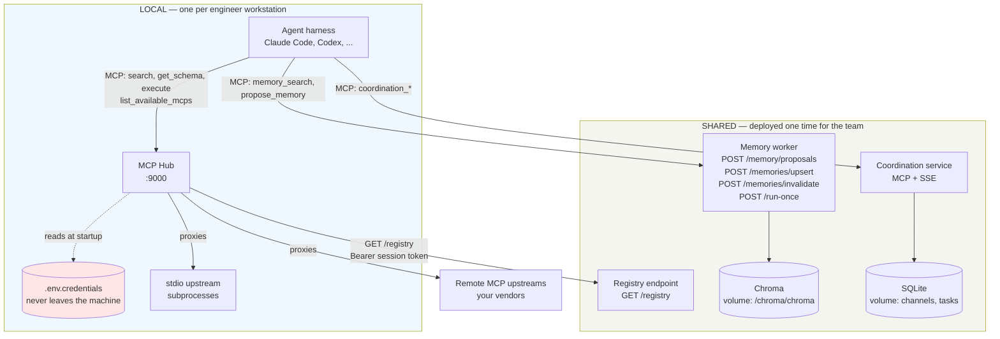

# Wagglebot Design Spec

> **Related specs:**
> - [Service contracts](2026-08-28-service-contracts.md) — behavior
>   contracts for the hub and the memory worker. The pitfall register
>   (P-numbers) is also there.
> - [Phase 1 — provisioning](2026-08-28-phase-1-provisioning.md),
>   [Phase 2 — the shared layer](2026-08-28-phase-2-shared-layer.md),
>   [Phase 3 — collaboration](2026-08-28-phase-3-collaboration.md),
>   [Phase 4 — document ingestion](2026-08-28-phase-4-document-ingestion.md).
> - [Descoped ideas](2026-08-28-descoped-ideas.md) — what we removed
>   from the MVP, and what would bring it back.
> - [Research list](2026-08-28-research-list.md) — ideas that need
>   study before a decision.

## Problem

Each AI agent that connects to company tools needs the same
infrastructure. This infrastructure includes an MCP aggregation layer,
durable memory, and a way to give every engineer the same skills and
instructions. Teams usually build this wiring in company-specific
monorepos. Vendor services are hardcoded into the config layer of those
monorepos.

We want a **reusable framework** that each team can clone, configure,
and deploy. No team must fork the internals of a different company.

## Goals

1. **Agent Environment Provisioning** (Phase 1) — One central
   repository and one update command install the curated skills, the
   subagents, one base instruction template, and the MCP configs, on
   every workstation and in every harness. Zero services (D34).
2. **Durable Memory** (local files in Phase 1, shared store in
   Phase 2) — An async pipeline that accepts structured facts. The
   agent extracts them, so no model runs on the write path (D24). The
   pipeline scans each write for credentials, deduplicates it, and
   stores it as a vector embedding for later retrieval.
3. **MCP Hub** (Phase 2) — One `/mcp` endpoint that proxies requests to
   any number of upstream MCP servers. The hub has zero hardcoded
   upstreams. In Phase 1, the update command writes the same curated
   registry into each harness config directly.
4. **Cross-Machine Collaboration** (Phase 3) — A coordination layer for
   agents on different machines. Agents discover each other, share
   memory, and hand off tasks. The scope is the system and branch of
   their humans.
5. **Runtime-Agnostic** — The framework services (hub, memory,
   coordination) run as standalone Docker containers. Any agent runtime
   (LangGraph, raw LLM loops, Claude Code) connects over HTTP/MCP.
6. **Deployment-Agnostic** — Wagglebot ships Docker images and a
   compose file, nothing else. The stack runs the same on a laptop, a
   self-hosted box, or any container platform. Development needs no
   cloud accounts. The optional batch extractor runs on a CPU (D2, D25).

## Non-Goals

- A specific agent runtime or LLM wrapper.
- Hardcoded support for any SaaS vendor. Users supply those as upstream
  MCP configs.
- A managed cloud platform or a billing layer.
- **Deployment tooling** (Terraform, Helm, cloud-specific IaC). The
  contract ends at containers with documented env vars and health
  endpoints. The operator selects where to run them.
- **Event-triggered agent flows** (a Sentry error or a Slack mention
  that starts an agent). A local agent with an MCP server already does
  this, under supervision. See the
  [descoped ideas](2026-08-28-descoped-ideas.md).
- **Running an agent on the shared server** (D31). Wagglebot
  distributes custom agents. Each one runs on a workstation, with the
  credentials of its engineer. Hosting them would break D9.

---

## Decisions

| # | Decision |
|---|---|
| D1 | The full stack is **TypeScript (Bun)**. The hub is built on `@modelcontextprotocol/sdk`. |
| D2 | **An extractor serves document ingestion only, never the session path (D24).** When a deployment enables the batch mode, the extractor uses **OpenAI-compatible HTTP only**. It does not load models in-process. The optional compose profile ships a `llama.cpp` server container with a small Qwen GGUF (~1.1 GB, CPU-friendly). A remote endpoint needs only a different `EXTRACTOR_API_BASE` value, no code change. |
| D3 | There is **no MCP wrapper service in front of Chroma**. The memory worker uses the official Chroma JS client. The memory worker also exposes a first-party MCP surface for search and proposals. The hub registers that surface like any upstream (guards P17). |
| D4 | Coordination runs as a **standalone container**. The hub registers it via `registry.yaml` like any other upstream. It never embeds in the hub. |
| D5 | (Phase 2) Task board: **FIFO claiming with an optional integer `priority`** (default 0, order `priority DESC, created_at ASC`). No deadlines, no scheduler. Each claim carries a **lease with a heartbeat and a monotonic fencing token**. An expired lease returns the task to the board. Delivery is **at-least-once**: completion requires the current fence, and external effects deduplicate on an idempotency key. |
| D6 | Messages are **persistent with replay**: an append-only log, cursor-based replay over SSE (`Last-Event-ID`), a 7-day TTL, and a SQLite store. |
| D7 | **Auth is fail-closed everywhere.** Each service requires a bearer token when one is configured. A network-exposed service refuses to start without one. One env name pattern applies: `<SERVICE>_BEARER_TOKEN` on the server, and the same name on clients (guards P2, P3, P11). |
| D8 | **One health convention:** `GET /livez` is shallow, always 200, and auth-exempt (process liveness). `GET /readyz` reports dependency and startup state, and returns 503 when the service cannot serve. Point load balancers at `/readyz`. |
| D9 | **The hub always runs local, on the engineer workstation.** The shared layer holds **no engineer credentials and no upstream MCP credentials**, and it never calls an upstream MCP server. It does hold its own service bearer tokens, which need normal secret storage and rotation. |
| D10 | **The config splits in two.** The shared registry declares each upstream and names its credential. It stores no secret. The local hub resolves each credential from the workstation. A team-wide token uses the same mechanism, with different distribution. |
| D12 | **People connect by username, never by address.** Each engineer registers with the company username (SSO name). All agent traffic flows outbound through the shared coordination service. A direct connection between two people requires an approval: the receiver sees who asks and accepts or rejects. No VPN, tunnel, or IP exchange exists in this design. |
| D13 | **Every executable dependency is pinned.** `stdio_npx` packages carry exact versions, container images pin digests, and `skills.list` pins revisions. Nothing installs `latest`. |
| D14 | **Four phases, each with a clean trigger.** **Phase 1 is provisioning:** one central git repository and one update command install the skills, the base prompts, the subagents, the MCP configs, and the local memory files. Zero services run, and no authentication exists, because git access is the access control (D15). **Phase 2 is the shared layer:** the memory worker with Chroma, the SSH auth (D26), registry serving, and the MCP hub. Its trigger: a team wants cross-repository memory search, or the tool count needs aggregation. **Phase 3 is collaboration:** presence, messaging, and the task board. Its trigger: two agents need to run at one time. **Phase 4 is document ingestion** (D25). Its trigger: bulk knowledge, for example Confluence pages, wanted in memory. |
| D15 | **Trusted coworkers.** Every registered engineer is trusted. Identity serves routing, context, and attribution. Teams and scopes never deny an operation between registered users. Git and the company identity provider control code access. Only impersonation protection and operator actions stay restricted (P34). |
| D16 | **The catalog uses the full Backstage entity model.** Component (one repository or subtree) sits in a System (one project), which sits in a Domain (a business area). A Group owns each entity, with `parent` for subteams. Ownership stays separate from grouping, so a reorganization edits one `owner` field. A branch is context, never identity (P33). |
| D19 | **Embeddings use the Chroma built-in default** (`all-MiniLM-L6-v2`, 384 dimensions, cosine distance). No second model service, no extra container, no GPU. Chroma persists the embedding function in the collection configuration, so every deployment stays consistent. Each collection still records the provider, the model, the dimension, the distance function, and a schema version, because a later model change needs a full re-embed. |
| D20 | **Catalog files use Backstage YAML.** The central `catalog.yaml` holds Domain, System, and Group entities. Each repository declares its components in `catalog-info.yaml`, or in `.wagglebot/catalog.yaml` with the identical schema. An organization already running Backstage points wagglebot at its existing files. Wagglebot never infers from a Git remote. An undeclared repository gets no system scope, and an unknown value is a hard error. |
| D21 | **Memory scopes follow the catalog: `component`, `system`, `domain`, `org`.** One scope exists per catalog level. A search reads component, then system, then domain, then organization. |
| D22 | **Agent writes default to `component`, with confirmed promotion to `system`.** The agent classifies each memory. A system classification is a proposal: the interactive agent asks its engineer in session. A background process never asks. A timeout or an uncertain classification falls back to `component`. A fact can land too low, never too high. |
| D23 | **Writes to `domain` and `org` are gated by the catalog.** A `domain` write requires membership in the owner group of that Domain. An `org` write requires the org-owner annotation on the User entity. Several users may carry the flag. Group membership lives only in the catalog. The gate restricts publication, never collaboration (D15). |
| D24 | **The agent extracts its own session memory.** It sends finished facts, never a transcript. The agent already holds the session context, and it is a stronger model than any bundled extractor. No model runs on the session write path, so the extractor stops being a bottleneck. The server still owns what a client must not: secret scrubbing, canonicalization, deduplication by content hash, embedding, and storage. A client is never a security boundary. |
| D25 | **(Phase 4) Document ingestion is a separate pipeline with a pluggable extract step.** A human names a source, for example a Confluence page. The pipeline fetches the content through an MCP tool, extracts facts, and writes them to a named scope. Two extract modes exist: `agent` (the default, and no extra container) and `local_llm` (an opt-in batch mode for bulk volume, D2). Ingestion inherits the authorization of its caller, so a write to `domain` still requires the owner group (D23). |
| D26 | **(From Phase 2) Authentication uses an SSH public key challenge, not a distributed token.** Phase 1 has no shared service, so it needs no authentication at all. The agent signs a server nonce with the existing SSH key of the engineer, and receives a short-lived session token. The default key source is the `wagglebot.dev/ssh-key` annotation on the User entity in the catalog, added by pull request. That works with every Git host, including Bitbucket Server. An optional `github` source fetches `<host>/<username>.keys` instead. No token needs delivery or rotation, and `users.yaml` therefore does not exist: identity lives in the catalog. |
| D27 | **The validation command rejects every duplicate.** Two entities of one kind sharing a name, a component naming an unknown system, and two channel routes matching one event are all hard errors. The message names the file and the value. Wagglebot never picks a winner silently (P35). |
| D28 | **Every memory write passes a credential scan.** Two layers run server-side: a **gitleaks** rule scan for known provider formats, and the entropy check for the formats no rule set knows. A match is redacted, and a mostly-matching write is rejected. The error names the rule, never the content. `wagglebot rescan` re-applies current rules to stored memory, because new rules arrive after old writes. Memory outlives logs, so a credential stored here would surface for years. |
| D29 | **Component memory is a local Markdown file, not a vector record.** The agent writes `.agents/memory.md` in the repository. The `.agents/` directory follows the emerging dotagents convention, and the name matters: an agent that never heard of wagglebot still recognizes `.agents/` from its training, even late in a polluted context. The rule: **agents read and write `.agents/`** (memory, component subagents), and **wagglebot tooling reads `.wagglebot/`** (`catalog.yaml`, `public.md`). One deliberate divergence from the draft convention: `memory.md` is **committed**, never gitignored, because the pull-request review is the feature. Git already distributes a file inside one repository, and the history is free. The shared store therefore holds only what crosses a repository boundary: `system`, `domain`, and `org`. A search still reads the local file first, then the three shared scopes. |
| D30 | **A human can commit a memory directly, with `remember`.** The MCP tool `remember({ text, scope })` and the command `wagglebot remember` write one fact to a named scope. This path is explicit, so the agent never judges the importance and never asks for a promotion confirmation (D22). The named scope still needs authorization (D23), the text still passes the credential scan (D28), and a `component` scope still writes the local file (D29). The matching `forget` tool invalidates a record the same way. |
| D31 | **Wagglebot distributes custom agents, and never runs one.** A shared agent runs on a workstation, with the credentials of its engineer, so D9 holds. Hosting agents would put engineer credentials on the shared server, make wagglebot a compute platform, and create the unattended operation that the MVP deliberately excludes. Distribution uses `agents.base.list` and `agents.team.<team>.list`, composed like the registry. A component agent needs no distribution: it lives in `.agents/subagents/` and travels with the repository. **Distribution is runtime-neutral.** A list entry may hold a Markdown subagent, a Flue agent, or any other shape. An agent declares the credentials it needs, by name, and follows D10. A missing credential marks that one agent unavailable with a clear reason, and never blocks the others. |
| D32 | **Agents distribute the same way as skills, and one pin rule covers both.** An entry pointing outside the organization **must** pin, because a third party controls its next release. An entry inside the organization **may** pin, because a pull request already reviews it, and a required pin there would guard against your own colleagues (D15). Two differences remain: a subagent installs to a harness directory rather than the skill directory, and the hub carries the agent list on its registry refresh, so a shared agent arrives without a command. |
| D33 | **Wagglebot ships first-party skills for its own toolset**, in one repository, `wagglebot/skills`. They version with wagglebot, because a format change breaks a skill on the same day. The set is `writing-a-custom-agent`, `adding-an-mcp-server`, and `onboarding-a-repository`. The first asks where an agent belongs before writing code, and explains the trade rather than choosing. **The split rule:** what the agent always needs goes in `AGENTS.base.md`, and what it needs occasionally becomes a skill. The memory rules are always needed. Everything else is occasional. |
| D34 | **One update command provisions a workstation, and nothing runs as a service in Phase 1.** The engineer flow is three commands, and only the last repeats: `git clone <company repo>`, `yarn install`, `yarn update:wagglebot`. The update script does three things: `git pull --ff-only` on the company repository, then the installers (skills, subagents, base prompts, MCP configs), then a summary. `yarn install` re-runs when the wagglebot pin moved, so the CLI updates itself through the normal dependency path. `--help` explains what the command touches. The MCP servers reach each harness as **written config**, in a managed block, composed locally: the script reads `catalog.yaml`, finds the team of the engineer by git username, and merges the registry layers on the workstation. The hub becomes the Phase 2 upgrade for aggregation and CodeMode. |
| D35 | **Wagglebot is a package, never a fork.** Wagglebot publishes two artifacts: Docker images (pinned by digest, D13) and one npm package that holds the CLI, the installers, the base template, and the harness target table. A company runs `bunx wagglebot@<version> init` one time, which scaffolds the **company repository**: their catalog, registries, lists, overlays, compose override, and a `package.json` that pins the wagglebot version. Not one file in that repository comes from the wagglebot source, so an upgrade is a one-line pin bump, reviewed in one pull request. Package content is never edited in place: extension happens through the company files and the overlays. The changelog must call out every base-template change, because overlays build on it. |

### Why D9 and D10 matter

The MCP specification makes the hub two things at once. The hub is a
resource server to the agent. The hub is also an OAuth client to each
upstream. The specification forbids a hub from forwarding the token of
its caller:

> MCP servers **MUST** validate that access tokens were issued
> specifically for them as the intended audience. [...] MCP servers
> **MUST NOT** accept or transit any other tokens.

A shared hub that proxies for many engineers must therefore hold a
separate credential for each engineer and each upstream. That design
needs a credential store, OAuth refresh, and a consent flow inside a
container.

D9 removes the whole problem. A local hub uses one identity: the
identity of its engineer. Upstream audit logs then name a real person.
Rate limits apply per person. No engineer secret reaches the shared
layer.

D9 limits the damage of a shared layer compromise. D9 does **not** make
the registry harmless: a registry selects commands and credential names,
so the hub applies a local trust policy to every remote registry
([contracts §C2](2026-08-28-service-contracts.md#c2-mcp-hub-contract),
P29).

---

## Architecture

### Two Layers, Four Phases

Wagglebot uses two layers. The split follows one rule: **credentials
stay on the workstation.**

| Layer | Runs where | Holds | Arrives |
|---|---|---|---|
| **Local** | Each engineer workstation | The engineer credentials, the skills, the subagents, the base prompt, the MCP configs, and the local memory files | **Phase 1** |
| **Shared** | Deployed one time for the team | The registry serving, memory, the auth, coordination, and ingestion | Phases 2–4 |

**Phase 1 runs no service.** The local layer is files, installed by one
command from one central git repository (D34, D14). An engineer clones,
runs `wagglebot update`, and works. The local MCP hub is a Phase 2
option, for aggregation and CodeMode.

A solo engineer never needs more than Phase 1. The compose profiles
serve the later phases
([phase 2 spec](2026-08-28-phase-2-shared-layer.md)).

### Interfaces At A Glance

Most of the surface is MCP tools, not HTTP. Six HTTP endpoints exist.



Read the diagram by following the arrows out of the agent. The agent
talks to three things, and always by MCP. Credentials touch one box.

| Surface | Kind | Who calls it |
|---|---|---|
| `search`, `get_schema`, `execute` | MCP tool | The agent, for every upstream tool |
| `list_available_mcps` | MCP tool | The agent, to see live namespaces |
| `memory_search` | MCP tool | The agent |
| `propose_memory` | MCP tool | The agent, from its own judgment (D24) |
| `remember`, `forget` | MCP tool | **You**, by telling the agent (D30) |
| `ingest_document` | MCP tool | You, to pull a page into memory (D25) |
| `coordination_*` (six tools) | MCP tool | The agent (Phase 3) |
| `GET /registry` | HTTP | The hub only, never the agent |
| `POST /memory/proposals` | HTTP | The memory MCP surface, internally |
| `POST /memories/upsert`, `/memories/invalidate` | HTTP | Humans and `wagglebot publish` (D23) |
| `POST /run-once` | HTTP | An operator, to drain the queue |
| `GET /livez`, `GET /readyz` | HTTP | The container runtime |

### Component Map

```
  LOCAL (per engineer workstation)      SHARED (deployed one time)
 ┌──────────────────────────────┐      ┌────────────────────────────┐
 │  Agent (any runtime)         │      │  registry (+ tool_catalog) │
 │      │ MCP_HUB_URL           │◄─────│  registry.yaml — NO secrets│
 │      ▼                       │ pull └────────────────────────────┘
 │  mcp-hub :9000               │      ┌────────────────────────────┐
 │  + engineer credentials      │─────▶│  memory-worker :3011       │
 │      │                       │ MCP  │    │ chroma-db :8000       │
 │      ├──────────────┐        │      │    └ extractor (optional)  │
 │      ▼              ▼        │      └────────────────────────────┘
 │  stdio MCP     remote MCP    │      ┌────────────────────────────┐
 │  subprocesses  upstreams     │─────▶│  coordination :3020 (Ph. 3)│
 └──────────────────────────────┘ MCP  │  presence · log · tasks    │
                                       └────────────────────────────┘
```

The shared layer never calls an upstream MCP server. Only the local hub
does that.

### The Phase Documents

| Phase | Document | Trigger |
|---|---|---|
| 1 | [Provisioning](2026-08-28-phase-1-provisioning.md) | Day 1 |
| 2 | [The shared layer](2026-08-28-phase-2-shared-layer.md) | Cross-repository memory search, or tool aggregation |
| 3 | [Collaboration](2026-08-28-phase-3-collaboration.md) | Two agents run at one time |
| 4 | [Document ingestion](2026-08-28-phase-4-document-ingestion.md) | Bulk knowledge, for example Confluence |

Cross-cutting implementation contracts live in the
[service contracts](2026-08-28-service-contracts.md). Success criteria
live in each phase document.

---

## Repository Structure

Two repositories exist, and the fork line between them is absolute
(D35): wagglebot publishes a package, and a company owns its content.

**The wagglebot repository (open source, published as images + one npm
package):**

```
wagglebot/
├── services/
│   ├── mcp-hub/                 # MCP aggregation proxy (TypeScript/Bun) → image
│   ├── memory-worker/           # Durable memory pipeline (TypeScript/Bun) → image
│   └── coordination/            # Presence, messaging, tasks (Phase 3) → image
├── packages/
│   ├── cli/                     # `wagglebot` npm package: update, init,
│   │   ├── bin/update           #   the installers, the harness target
│   │   ├── bin/install-skills   #   table, and the templates
│   │   ├── bin/install-agents
│   │   ├── bin/sync-agents
│   │   └── templates/
│   │       ├── AGENTS.base.md   # Shared agent base template
│   │       ├── hooks/           # Per-harness hook fragments
│   │       └── init/            # The `wagglebot init` scaffold
│   └── types/                   # Shared types (MemoryProvider, JobSpec, ...)
├── docker-compose.yml           # Base compose, extended by the company override
├── .env.example
└── README.md
```

**The company repository (scaffolded once by
`bunx wagglebot@<version> init`, owned by the company):**

```
acme-wagglebot/
├── package.json                 # "wagglebot": "1.4.2" ← THE pin, plus
│                                #   "scripts": { "update:wagglebot": "wagglebot update" }
├── catalog.yaml                 # domains, systems, groups, users (+ssh keys)
├── registry.base.yaml           # MCP upstreams, all teams
├── registry.team.<team>.yaml
├── tool_catalog.yaml            # routing advice
├── skills.list                  # third-party pins + own skills (D32)
├── agents.base.list             # shared custom agents (D31, D32)
├── agents.team.<team>.list
├── overlays/                    # additions to AGENTS.base.md, append-only
├── docker-compose.override.yml  # Phase 2 deployment choices
└── README.md                    # generated: the three-command engineer flow
```

Not one file in the company repository comes from the wagglebot
source. The engineer flow:

```
git clone <company repo>
yarn install            # materializes the pinned wagglebot CLI
yarn update:wagglebot    # provisions the workstation (D34)
```

The company upgrade flow is one line: bump the pin in `package.json`,
review the changelog, merge. Every workstation upgrades at its next
`yarn update:wagglebot`, because the update script re-runs
`yarn install` when the pin moved.

The scaffold command carries a version for the same reason every other
executable is pinned (P31, D13): `bunx wagglebot@<version> init`,
never a floating `bunx wagglebot init`.

---

## Before Implementation

One document is still missing, and it gates the Phase 2 code:
`api-reference.md`. It must give, for every HTTP endpoint and every MCP
tool:

* The request and response shape, versioned.
* The error codes, the size limits, and the rate limits.
* The idempotency rules per mutation.
* Every persisted record type and its collection.
* The publication flow: discovery, revision key, atomic replacement.

Phase 1 needs no API document. The provisioning spec alone is enough to
start that implementation.

## Open Questions

- Does the Chroma JS client require a scope fan-out workaround for
  array-valued metadata (`scope_id_0..5`, `$or` caps — P16)? Verify
  during implementation.
- Does the pinned Chroma JS client resolve the persisted embedding
  function on `getCollection`, or does it still require the function as
  a parameter (D19)? Verify before the first write.
- (Phase 3) What does the message bus return for an expired replay
  cursor, and how does a client resynchronize? Define the ordering and
  the backpressure behavior with the Phase 3 API shapes.

## Parking Lot — Ideas to Discuss

> Captured but not yet designed. An idea that needs study before a
> decision goes to the [research list](2026-08-28-research-list.md)
> instead.

- [ ] _Your ideas go here — tell me what else you have in mind._
