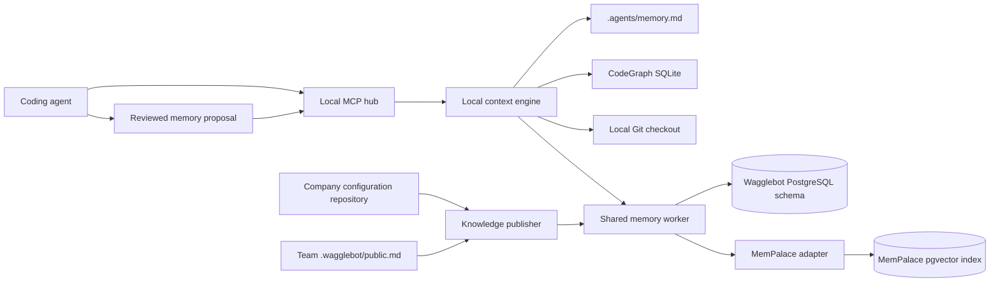

# Phase 2 Memory Roadmap

**Status:** Approved direction; the memory core is split into three
independently testable specifications and plans, sequenced with the approved
D26, registry, MCP hub, and Context Bridge work below.

> This roadmap refines the memory portion of
> [Phase 2 — The Shared Layer](2026-08-28-phase-2-shared-layer.md). It does not
> replace the MCP hub, SSH authentication, registry, or catalog designs in the
> existing specifications.

## Purpose

Phase 2 gives an agent enough trustworthy context to work across a component,
its system, its domain, and the organization. It keeps component knowledge in
Git, adds exact local code and history retrieval, and makes reviewed company
knowledge searchable through the shared memory service.

This roadmap consolidates the colleague's Wagglebot design and decisions D1–D37
with the agreed Phase 2 requirements for human-readable memory, provenance,
CodeGraph, Git history, lexical retrieval, wake context, and a unified context
engine.

## Fixed Decisions

The following decisions remain unchanged:

- **D9:** the MCP hub and repository-aware context processing run on the
  engineer's workstation. Shared services never receive source code, a code
  graph, a Git checkout, engineer credentials, or upstream MCP credentials.
- **D20–D23:** Backstage entities determine component, system, domain, owner,
  and write authorization. Wagglebot never infers them from a Git remote.
- **D24:** agents submit finished facts. No model runs on the session-memory
  write path, and transcripts are not submitted.
- **D28:** every shared-memory write passes the server-side credential scan.
- **D29:** component memory is one committed `.agents/memory.md` file. It is
  never stored as a shared vector record.
- **D35:** a company owns a configuration repository generated by
  `wagglebot init`; it does not fork Wagglebot.

## Phase 2 Memory Amendments

These decisions extend the existing design without changing its scope model.

| # | Decision |
|---|---|
| M1 | **MemPalace 3.9.0 with its `pgvector` backend replaces Chroma for shared retrieval.** Wagglebot-owned services remain TypeScript/Bun. MemPalace is a pinned external service dependency behind the memory worker. |
| M2 | **PostgreSQL is the shared memory control store and pgvector host.** Wagglebot owns canonical records, provenance, status, deduplication keys, and an indexing outbox in its own schema. MemPalace owns its index in a separate schema or table namespace in the same company-operated database. |
| M3 | **The shared memory worker remains the only public memory boundary.** Clients cannot call MemPalace directly. The worker enforces SSH-session identity, catalog scopes, credential scanning, source replacement, and invalidation before invoking the MemPalace adapter. |
| M4 | **The company configuration repository is the source of reviewed shared knowledge and non-secret configuration.** Database credentials and TLS keys remain deployment secrets. |
| M5 | **CodeGraph 1.6.0 is repository-local.** Its generated `.codegraph/codegraph.db` SQLite graph is ignored by Git, never uploaded, and built once before incremental/watch updates. An optional `codegraph.json` is committed only when a repository needs custom inclusion, exclusion, extension, or ranking rules. |
| M6 | **Git history is queried from the current local checkout.** `git.why` returns commit, blame, and diff evidence. Generated explanations never replace the commits or source they cite. |
| M7 | **BM25 is the local lexical channel for `.agents/memory.md` and bounded Git candidates.** Shared retrieval uses MemPalace's semantic and lexical channels. Fusion uses reciprocal-rank fusion, so provider-specific raw scores are never compared directly. |
| M8 | **The local context engine composes results; it does not become another source of truth.** It returns compact, provenance-bearing context packets with freshness and degradation metadata. |
| M9 | **Automatic transcript mining and automatic project mining are disabled.** An agent may distill a durable local-memory proposal from its active chat context, but it never stores the transcript and never writes the proposal until a person explicitly asks to remember it or approves the proposed diff. Only an accepted structured fact or an explicitly selected, reviewed Git knowledge source enters shared memory. |
| M10 | **The temporal project graph, agent diaries, automatic task state, multi-agent handoffs, review UI, and Confluence ingestion stay outside this Phase 2 memory increment.** They require their own later specifications. |
| M11 | **Local memory uses a propose-and-save workflow.** Manual Markdown edits remain supported. `brain_memory_propose` creates an ephemeral, evidence-bearing diff; `brain_memory_save` applies that exact proposal atomically against the file hash. Explicit requests such as “remember this” may invoke both operations in one authorized flow. |
| M12 | **Context loads progressively.** A new chat receives only a local L0 identity envelope capped at 150 estimated tokens. Repository memory, Git history, CodeGraph results, and shared facts are retrieved after the user supplies a task, asks to continue, or explicitly requests deeper context. |
| M13 | **Unsolicited shared context is a small, reviewed exception.** L1 may include at most three active, high-confidence records explicitly marked `wake: true`, within a 200-token shared sub-budget. Task retrieval may include at most three relevant shared records by default. Agents cannot mark their own proposal as wake-eligible. |
| M14 | **One fact enters the model context once.** MCP responses never repeat the same prose in both text and structured content. A short-lived context cursor suppresses unchanged evidence already delivered in the current chat; full evidence is fetched only through its handle. |

## Alignment with the Source Designs

The implementation keeps the colleague's Phase 2 boundaries: one reviewable
component-memory file, catalog-derived scopes, finished shared facts, server-side
secret scanning, a company-owned configuration repository, and the local MCP
hub. It also keeps the local-brain blueprint's CodeGraph, Git evidence, wake
context, provenance, and ranked retrieval.

The deliberate changes and deferrals are:

| Source direction | Phase 2 decision | Reason |
|---|---|---|
| Chroma for shared retrieval | MemPalace with PostgreSQL/pgvector | Approved storage and retrieval substitution; the scope and provenance model stays the same. |
| Earlier repository-memory filename | `.agents/memory.md` | Uses the colleague's approved D29 path and retains human-readable, Git-reviewed behavior. |
| Local vector memory in the broader blueprint | Markdown plus in-memory BM25 locally; pgvector only for shared memory | Keeps component memory inspectable and avoids duplicating the shared semantic index. |
| Multiple `.agent/` task, diary, handoff, and generated files | Deferred | D29 defines one durable component-memory file for this phase. |
| Automatic transcript indexing and session persistence | Curated proposal from active context, followed by explicit promotion | Preserves useful discoveries without retaining raw conversations or speculative state. |
| Temporal knowledge graph, review UI, and external documentation ingestion | Deferred | Valuable follow-up work, but not required for the agreed Phase 2 memory core. |
| Direct use of MemPalace by clients | Access through the shared memory worker | Preserves authentication, authorization, provenance, invalidation, and secret scanning. |

These changes narrow the larger blueprint to the agreed Phase 2 slice. They do
not change the component/system/domain/organization scope model or the
local-first privacy boundary.

## Progressive Context Loading

The brain is a retrieval system, not a prompt that is injected in full. Its
default flow is:

```text
new chat
  → L0 identity/status envelope (local only, maximum 150 tokens)
  → user supplies a task or asks to continue
  → bounded task/continuation retrieval
  → short facts plus evidence handles
  → explicit deeper retrieval when needed
```

L0 includes repository identity, branch, HEAD, dirty state, and compact provider
state. It includes no memory body, Git list, code snippet, or shared-memory
content and makes no network request. If the first request already includes a
concrete task, the caller may go directly to L2 because L2 includes the L0
fields.

Every later packet has both a token budget and an item cap. The context engine
returns a cursor representing evidence already delivered in that chat. A later
request with the cursor omits an unchanged item and reports it under
`already_delivered`; a changed content hash makes the item eligible again. The
cursor stores identifiers and hashes only and expires with local process state.

Shared memory is never bulk-injected. Human-reviewed `wake: true` records form a
small guardrail set for continuation context. Ordinary shared knowledge remains
searchable for a concrete task or explicit query. This keeps ordinary new-chat
startup independent of shared-memory availability and token-heavy retrieval.

## Architecture



The boundary is intentional:

- Local code, diffs, file paths, and the generated graph remain on the
  workstation.
- Shared memory receives finished facts and reviewed Markdown knowledge.
- The context engine may send a text search query and resolved scope identifiers
  to the shared worker. It never sends source files or arbitrary repository
  content.
- The database is a derived search/control system for Git-published knowledge.
  Git remains authoritative for those documents.

## Authoritative Storage

| Information | Authority | Search or generated representation |
|---|---|---|
| Component knowledge | `<component>/.agents/memory.md` | In-memory local BM25 index |
| Current code structure | Current checkout | `.codegraph/codegraph.db` |
| Change history and rationale | Git commits, diffs, and blame | Bounded in-memory Git candidate index |
| Confirmed system facts | Wagglebot PostgreSQL record | MemPalace pgvector/lexical index |
| Domain conventions | Reviewed company Git documents | Wagglebot record plus MemPalace index |
| Organization contracts | Team `.wagglebot/public.md` and reviewed company documents | Wagglebot record plus MemPalace index |
| Catalog and ownership | Company configuration repository | Loaded service cache |

## Company Configuration Repository

The repository keeps the Phase 1 shape and adds reviewed knowledge directories:

```text
company-wagglebot-config/
├── package.json
├── wagglebot.yaml
├── tool_catalog.yaml
├── docker-compose.override.yml
├── company/
│   ├── catalog.yaml
│   ├── registry.yaml
│   ├── agents.list
│   ├── skills.list
│   ├── agents/
│   ├── instructions/
│   └── knowledge/
│       ├── architecture/
│       ├── engineering/
│       └── operations/
└── teams/
    └── <group>/
        ├── catalog.yaml
        ├── registry.yaml
        ├── agents.list
        ├── skills.list
        ├── agents/
        ├── instructions/
        └── knowledge/
            ├── conventions/
            └── runbooks/
```

`wagglebot.yaml` contains non-secret settings and environment-variable names:

```yaml
version: 1
memory:
  provider: mempalace
  backend: pgvector
  dsnEnv: MEMPALACE_PGVECTOR_DSN
  namespace: company-wagglebot
  embedding:
    model: minilm
    dimension: 384
  publication:
    companyKnowledge: company/knowledge/**/*.md
    teamKnowledge: teams/*/knowledge/**/*.md
```

The actual DSN, passwords, bearer keys, SSH signing material, and TLS private
keys are absent from Git.

## How Local Memory Is Saved

Local memory has three entry paths:

1. A developer edits `.agents/memory.md` directly.
2. A developer tells the agent to remember or save a durable fact. That request
   authorizes the agent to distill the fact, show the resulting change, and save
   it through the local memory API.
3. At a task boundary or before compaction, an agent may suggest a concise
   memory derived from the active conversation. The suggestion is ephemeral and
   becomes durable only after the developer promotes it.

The saved entry contains a short title, a concise fact or decision, and
provenance such as a file and line, commit, ADR, issue, test result, or explicit
maintainer confirmation. The agent never copies the raw conversation into the
file. The save path scans for secrets, checks for duplicates or conflicts,
compares the proposal's base content hash with the current file, and writes
atomically. The resulting Markdown diff follows the repository's normal review
and commit workflow.

## Delivery Sequence

The complete Phase 2 order is authoritative in the
[Phase 2 Implementation Sequence](../plans/2026-09-12-phase-2-implementation-sequence.md).
The local brain is deliberately delivered before any shared service.

| Milestone | Result | Dependency |
|---|---|---|
| 1. Local Repository Brain | `.agents/memory.md` retrieval, persistent CodeGraph index, Git evidence, and local MCP operations | CodeGraph 1.6.0 and Phase 1 component/catalog files |
| 2. D26 Authentication | SSH challenge signing and audience-bound workstation session tokens | Backstage User entities and registered public keys |
| 3. Authenticated Registry and Local MCP Hub | Principal-specific company/team registry serving, local credentials, trust approvals, four transports, discovery, and CodeMode | Milestones 1 and 2 plus the Phase 1 company repository layout |
| 4. Shared Memory Foundation | Catalog-scoped records, reviewed Git publication, MemPalace pgvector indexing, search, invalidation, and operations | Milestone 2 and PostgreSQL with `vector` |
| 5. Unified Context Engine | Wake/search/explain packets that fuse local memory, code, Git, and shared memory | Milestones 1, 3, and 4 |
| 6. Local Context Bridge | Explicit, expiring, same-user context transfer between local chats | Milestone 5 |

The milestones use these approved designs and implementation plans in delivery
order:

- [Local Repository Brain design](2026-09-11-local-repository-brain-design.md)
- [Local Repository Brain plan](../plans/2026-09-11-local-repository-brain.md)
- [D26 SSH Authentication plan](../plans/2026-09-12-d26-ssh-authentication.md)
- [Authenticated Registry Serving plan](../plans/2026-09-12-authenticated-registry-serving.md)
- [Local MCP Hub plan](../plans/2026-09-12-local-mcp-hub.md)
- [Shared Memory Foundation design](2026-09-11-shared-memory-foundation-design.md)
- [Shared Memory Foundation plan](../plans/2026-09-11-shared-memory-foundation.md)
- [Unified Context Engine design](2026-09-11-unified-context-engine-design.md)
- [Unified Context Engine plan](../plans/2026-09-11-unified-context-engine.md)
- [Context Bridge design](2026-09-12-context-bridge-design.md)
- [Context Bridge plan](../plans/2026-09-12-context-bridge.md)

## Release Gates

The complete Phase 2 memory increment is ready when:

1. A repository with only `.agents/memory.md`, Git, and CodeGraph can answer a
   local question while the shared service is offline.
2. A second repository in the same system can retrieve a confirmed system fact
   without seeing the first repository's component memory.
3. A reviewed company knowledge change replaces its previous indexed revision,
   and removing the source removes it from later searches.
4. A team publication in `.wagglebot/public.md` is searchable from another team
   with its Git provenance intact.
5. A secret-like fixture is redacted or rejected before it reaches PostgreSQL or
   MemPalace.
6. A CodeGraph index survives session restarts and updates incrementally after a
   source edit.
7. `brain_wake` returns useful context inside its budget even when either the
   graph or the shared service is unavailable.
8. No test or telemetry capture contains source code, memory content, search
   queries, credentials, DSNs, or private file paths.
9. A chat-derived local-memory suggestion remains ephemeral until promoted; an
   explicitly promoted proposal writes one reviewed Markdown entry with
   provenance and no transcript content.
10. A new chat receives no more than 150 estimated context tokens before a task
    is known and performs no shared-memory request.
11. L1 contains no more than three wake-eligible shared facts and spends no more
    than 200 estimated tokens on them; L2 contains no more than three shared
    results by default.
12. Reusing a context cursor does not resend unchanged evidence, and the MCP
    envelope never duplicates fact content across text and structured output.

## Upstream Baseline

The versions evaluated for this design on 2026-09-11 are:

- [CodeGraph 1.6.0](https://github.com/colbymchenry/codegraph), MIT licensed.
  Its public documentation describes local SQLite/FTS5 storage, incremental
  synchronization, MCP, and a TypeScript API.
- [MemPalace 3.9.0](https://github.com/MemPalace/mempalace), MIT licensed. Its
  public documentation lists a `pgvector` backend with namespace and lexical
  support and an authenticated HTTP MCP server.

Implementation must pin these exact versions first. An upgrade is a separate,
reviewed dependency change with compatibility tests and migration notes.
