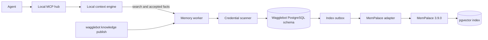

# Shared Memory Foundation Design

**Status:** Approved architecture

> **Parent:** [Phase 2 Memory Roadmap](2026-09-11-phase-2-memory-roadmap.md)  
> **Implements:** the memory portion of
> [Phase 2 — The Shared Layer](2026-08-28-phase-2-shared-layer.md) and
> [service contract C3](2026-08-28-service-contracts.md#c3-memory-worker-contract-phase-2-component-memory-is-a-phase-1-local-file-d29)  
> **Plan:** [Shared Memory Foundation implementation plan](../plans/2026-09-11-shared-memory-foundation.md)

## Problem

Wagglebot already defines shared `system`, `domain`, and `org` memory,
catalog-scoped publication, server-side credential scanning, and a memory MCP
surface. The earlier design selects Chroma and a filesystem queue. The approved
Phase 2 direction instead uses a company-operated PostgreSQL/pgvector database,
MemPalace as the retrieval engine, and the company configuration
repository as the source of reviewed company knowledge.

The change must retain the colleague's safety and ownership model. MemPalace is
an implementation dependency. It does not become an authorization boundary,
canonical record store, or direct agent endpoint.

## Goals

1. Store confirmed system facts and reviewed domain/organization knowledge with
   complete provenance.
2. Search the caller's `system → domain → org` cascade through semantic and
   lexical retrieval.
3. Keep reviewed Git documents authoritative and replace their indexed records
   deterministically when their source revision changes.
4. Preserve D22/D23 write rules and D28 credential scanning.
5. Make accepted writes immediately available even while semantic indexing is
   delayed.
6. Run on company-controlled infrastructure with PostgreSQL, pgvector, TLS, and
   pinned dependencies.
7. Keep MemPalace replaceable through a small provider interface.
8. Supply at most a few explicitly reviewed shared facts to automatic
   continuation context while keeping the wider corpus available for search.

## Non-Goals

- Component memory. It stays in `.agents/memory.md` under D29.
- Uploading code, CodeGraph data, Git diffs, or repository working trees.
- Mining transcripts, agent conversations, or an entire checkout.
- Confluence or arbitrary document ingestion. That remains Phase 4.
- Coordination, agent diaries, or MemPalace logstream features.
- A new authorization model. The design uses D15, D20–D23, and D26.
- A model-based extractor or reranker on the session path.

## Service Boundary



Only the memory worker is network-addressable to Wagglebot clients. MemPalace
runs on an internal container network and accepts calls only from the worker.
PostgreSQL is also private. The worker verifies the D26 session token or the
administrator publication principal before it reads or mutates memory.

All Wagglebot-owned runtime code is TypeScript on Bun. MemPalace's Python
runtime is accepted as a pinned external container in the same way that
PostgreSQL and gitleaks are external runtime dependencies. Wagglebot does not
fork or patch MemPalace.

## Sources of Truth

Shared records have two authority models:

### Confirmed system memory

A system fact proposed by an agent becomes authoritative when the interactive
agent records the engineer's confirmation. Its canonical representation is the
Wagglebot PostgreSQL record. The agent submits the finished fact, never the
transcript that produced it.

An explicit `remember` command does not need a second promotion question under
D30. The user already named the scope.

### Reviewed Git knowledge

Domain conventions and organization contracts are authored and reviewed in
Git. Their Markdown source is authoritative. PostgreSQL and MemPalace contain a
derived revision that can be rebuilt from the Git source.

Supported sources are:

- `company/knowledge/**/*.md` in the company configuration repository;
- `teams/<group>/knowledge/**/*.md` in that repository;
- `.wagglebot/public.md` in a component/team repository.

The publisher accepts only committed content and records the full commit SHA.
It refuses a dirty source file so an unreviewed working-tree edit cannot become
shared knowledge by accident.

## Company Knowledge Format

Every file below `company/knowledge/` or `teams/<group>/knowledge/` begins with
this front matter:

```yaml
---
wagglebot:
  schemaVersion: 1
  title: PostgreSQL engineering conventions
  kind: convention
  scope: domain:payments
  owner: team-payments
  wake: true
  reviewAfter: 2027-03-01
---
```

Rules:

- `schemaVersion` is exactly `1`.
- `title` is a non-empty human title.
- `kind` is one of `fact`, `decision`, `warning`, `convention`, `interface`, or
  `runbook`.
- `scope` is `system:<name>`, `domain:<name>`, or `org`. `component` is rejected.
- `owner` names a Group in the catalog.
- `wake` is optional and defaults to `false`. `true` makes a record eligible
  for compact L1 continuation context; it does not guarantee inclusion.
- `reviewAfter` is an ISO date, is required when `wake: true`, and must be no
  more than 366 days after publication. Republish the reviewed document to
  renew it.
- A system's or domain's catalog owner must equal `owner`.
- An `org` document under `teams/<group>/knowledge/` is rejected. A team's
  organization contract belongs in `.wagglebot/public.md`.
- An `org` document under `company/knowledge/` is accepted only through the
  administrator publication principal.
- Unknown front-matter keys fail validation. Silent typos are not accepted.

`.wagglebot/public.md` keeps the earlier contract and needs no front matter. The
publisher resolves its closest component declaration, system, domain, and owner
from the catalog, assigns `scope: org`, `kind: interface`, and uses the first
level-one heading as its title. A missing component declaration, owner, or title
is a hard error.

## Deterministic Chunking

The publisher does not summarize a reviewed document. It stores its authored
text in deterministic sections:

1. Parse Markdown without executing HTML.
2. Keep heading ancestry with every section.
3. Start a chunk at each level-two or level-three heading.
4. Combine adjacent paragraphs until adding the next paragraph would exceed
   4,000 Unicode code points.
5. Split an individual longer paragraph at sentence boundaries; if no sentence
   boundary exists, split at 4,000 code points.
6. Do not overlap chunks. The heading ancestry supplies the missing context.
7. Ignore an empty section and fail a document with no body content.

Every chunk receives a stable identifier:

```text
sourceKey = sha256(repoIdentity + NUL + relativePath + NUL + scope)
chunkKey  = sha256(sourceKey + NUL + headingPath + NUL + ordinal)
recordId  = UUIDv5(wagglebotMemoryNamespace, chunkKey)
```

The same source at a new commit produces the same logical record identifiers
when its section structure is unchanged. Content changes produce new record
revisions rather than unrelated records.

## Data Model

The public contract uses these TypeScript types:

```typescript
type SharedScope =
  | { kind: "system"; name: string }
  | { kind: "domain"; name: string }
  | { kind: "org" };

type MemoryKind = "fact" | "decision" | "warning" | "convention" | "interface" | "runbook";
type MemoryStatus = "pending_index" | "active" | "superseded" | "invalidated" | "index_failed";

type Provenance = {
  sourceType: "agent" | "human" | "git";
  actor: string;
  repository?: string;
  path?: string;
  commitSha?: string;
  heading?: string;
  sourceKey?: string;
  capturedAt: string;
};

type MemoryRecord = {
  id: string;
  schemaVersion: 1;
  scope: SharedScope;
  kind: MemoryKind;
  title: string;
  content: string;
  canonicalKey: string;
  identityKey: string;
  contentHash: string;
  confidence: "low" | "medium" | "high";
  status: MemoryStatus;
  wake: boolean;
  reviewAfter?: string;
  provenance: Provenance[];
  supersedes?: string;
  supersededBy?: string;
  createdAt: string;
  updatedAt: string;
};
```

`canonicalKey` and `identityKey` retain the existing C3 reconciliation
semantics. A Git publication uses the stable `chunkKey` as its identity. An
agent fact uses `kind:subject:relation:value` for its canonical key and
`kind:subject:relation` for identity.

The Wagglebot database schema owns:

- `memory_records`: canonical text, keys, scope, status, confidence, wake flag,
  review date, timestamps, scanner metadata, and current MemPalace drawer
  identifier;
- `memory_provenance`: one immutable evidence row per source reference;
- `memory_sources`: current Git revision, source key, repository, path, scope,
  and publication actor;
- `memory_index_jobs`: transactional add/delete work with attempts and retry
  time;
- `memory_embedding_profiles`: provider, model, dimension, distance, schema
  version, and activation state;
- `memory_audit_events`: append-only accepted/rejected/redacted/invalidated
  operation metadata without memory content.

Database constraints reject `component` scope, an unknown status/kind, a blank
scope name, and more than one active row for the same `(scope, canonical_key)`.

## MemPalace Mapping

The adapter uses MemPalace's documented MCP tools and does not import its
internal Python modules:

```typescript
type SharedMemoryProvider = {
  status(): Promise<ProviderStatus>;
  index(record: MemoryRecord): Promise<{ providerId: string }>;
  remove(providerId: string): Promise<void>;
  search(input: { query: string; scopes: SharedScope[]; limit: number }): Promise<ProviderHit[]>;
};
```

Mapping:

| Wagglebot field | MemPalace field |
|---|---|
| `system:payments-platform` | wing `wgl-system--payments-platform` |
| `domain:payments` | wing `wgl-domain--payments` |
| `org` | wing `wgl-org` |
| memory kind | room |
| formatted record | drawer content |
| stable source token | `source_file` |
| principal username | `added_by` |

Drawer content is a parseable envelope followed by verbatim content:

```text
Wagglebot-Memory-ID: 018f...
Schema-Version: 1
Scope: domain:payments
Kind: convention
Title: PostgreSQL engineering conventions
Source-Key: wglsrc_5f61...

<verbatim reviewed content>
```

The record ID lets the worker join a search hit back to canonical PostgreSQL
metadata. A hit with an unknown, inactive, or scope-mismatched record ID is
dropped. This prevents a delayed provider deletion from returning stale data.

MemPalace starts with:

```text
MEMPALACE_BACKEND=pgvector
MEMPALACE_PGVECTOR_DSN=<deployment secret>
MEMPALACE_MCP_IDLE_HOURS=0
```

Its image is pinned by digest. Its palace namespace is deployment-specific.
No transcript or project directory is mounted. The `mine`, diary, coordination,
knowledge-graph, and direct mutation surfaces are inaccessible to clients.

## Write Pipeline

### Agent proposal

```text
propose_memory
  → verify D26 principal
  → validate finished-fact schema
  → require system confirmation evidence for system scope
  → scan credentials
  → canonicalize and reconcile
  → transaction: record + provenance + index job
  → return accepted record
  → outbox worker indexes through MemPalace
```

The worker rejects a component proposal with an instruction to update
`.agents/memory.md`. It rejects domain or organization proposals from agents.

### Explicit human memory

`remember` accepts system, domain, or organization scope. It applies D23 to
domain and organization writes. A successful transaction makes the record
immediately available to the PostgreSQL lexical fallback while the vector job
runs. The response reports `indexState: "pending" | "active"`.

### Git publication

```text
knowledge publish
  → verify clean committed source
  → validate front matter and catalog ownership
  → deterministic chunk and credential scan
  → POST complete source revision
  → transaction: stage new records, supersede removed/changed records,
                 update source revision, enqueue adds/deletes
  → return source/revision/counts
```

The request includes the complete set of chunks for one source. Partial source
replacement is not an API. Repeating the same revision is a no-op. An older
revision returns `409 source_revision_regressed` unless the administrator uses
the separate restore operation with an audit reason.

Removing a source calls publication with an empty record set and the commit that
removed it. The transaction invalidates the previous records immediately.

### Invalidation and superseding

`forget` marks a record `invalidated`, records actor/reason/time, and enqueues
provider deletion. It never deletes audit or provenance rows. Reconciliation of
a new value marks the previous record `superseded` and links both directions.

## Index Outbox

PostgreSQL replaces the old filesystem queue because the database is already a
required shared dependency. Workers claim jobs with `FOR UPDATE SKIP LOCKED`.
Each job has an immutable operation key, three attempts, exponential retry at
1, 5, and 30 seconds, and a final `index_failed` state.

An index failure does not lose the canonical record. Search returns lexical
results from PostgreSQL and marks the response degraded. `wagglebot memory
reindex` re-enqueues every active record for the active embedding profile.

Only one MemPalace server process may own a palace writer lease. Wagglebot may
run more than one memory-worker HTTP replica because the PostgreSQL outbox
serializes jobs, but deployments start with one index-worker consumer. Scaling
the consumer requires a verified MemPalace multi-writer design and a new
decision.

## Search Pipeline

Query input is a discriminated union:

```typescript
type MemorySearchInput =
  | {
      purpose: "query";
      query: string;
      cascade: { system?: string; domain?: string; includeOrg: true };
      explicitScopes?: SharedScope[];
      limit?: number;
    }
  | {
      purpose: "wake";
      cascade: { system?: string; domain?: string; includeOrg: true };
      limit?: 1 | 2 | 3;
    };
```

The default cascade is `system → domain → org`. An explicit scope is allowed for
any registered engineer under D15; it affects relevance, not authorization.
The worker validates every named entity against the catalog.

Search runs two independent channels:

1. PostgreSQL full-text/exact search over active canonical records. This is the
   immediate and degraded-mode channel.
2. MemPalace semantic plus lexical retrieval, overfetching up to four times the
   requested limit so inactive or out-of-scope hits can be removed safely.

Results merge with reciprocal-rank fusion using `k = 60`. Exact title and
canonical-key matches receive a deterministic tie-break boost. Raw PostgreSQL
and MemPalace scores are returned for diagnostics but are never added or
compared directly.

Final ordering uses scope specificity only as a tie-break:

```text
system > domain > org
```

Every hit contains its record ID, scope, kind, title, content, status,
provenance, fused rank, and channel ranks. Search returns at most 20 results and
clips request text at 2,000 Unicode code points.

### Wake-eligible shared facts

`purpose: "wake"` does not run semantic search and accepts no free-text query.
It reads canonical PostgreSQL records only. A record is eligible when all of
these are true:

- `status` is `active`;
- `wake` is `true`;
- `confidence` is `high`;
- `reviewAfter` is today or later; and
- its scope belongs to the requesting component's system → domain → org
  cascade.

The worker orders eligible records by kind (`warning`, `decision`, `interface`,
`convention`, `fact`, `runbook`), then scope specificity, most recent review,
and stable record ID. It returns at most three records plus a count of additional
eligible records. The context engine owns the separate 200-token rendering
budget and may include fewer.

An agent proposal cannot set `wake: true`. An explicit human `remember` may set
it when the named scope passes D23 authorization, and a reviewed Git source may
set it through front matter. Every enabling or renewal records the authenticated
actor in provenance/audit metadata. An expired record remains available to an
explicit search and simply leaves automatic continuation context.

## HTTP and MCP Contracts

HTTP endpoints use `/v1` and JSON:

| Endpoint | Purpose |
|---|---|
| `POST /v1/memory/proposals` | Accepted agent-generated system facts |
| `POST /v1/memories` | Explicit human `remember` |
| `POST /v1/memories/:id/invalidate` | `forget` with reason |
| `POST /v1/memory/search` | Scoped hybrid search |
| `GET /v1/memories/:id` | Exact record and provenance |
| `PUT /v1/publications/:sourceKey` | Complete Git source revision replacement |
| `POST /v1/admin/rescan` | D28 credential rescan |
| `POST /v1/admin/reindex` | Rebuild active provider index |
| `GET /livez` | Process liveness, auth-exempt |
| `GET /readyz` | PostgreSQL, catalog, scanner, and provider readiness |

The MCP surface retains the names in the existing service contract:

- `memory_search`
- `memory_query`
- `propose_memory`
- `remember`
- `forget`

Publication, rescan, restore, and reindex remain administrator CLI/HTTP
operations. They are not agent tools.

## Authentication and Authorization

- A D26 short-lived session token identifies the engineer. The worker verifies
  audience, issuer, signature, expiry, and username.
- The worker reloads catalog membership on a bounded refresh interval and fails
  closed for writes if the catalog is unavailable or invalid.
- System proposals require `confirmedBy` equal to the authenticated username
  and a confirmation timestamp no older than the session token.
- Agent proposals always persist with `wake: false`. Enabling or renewing wake
  eligibility requires an explicit human `remember` or reviewed Git
  publication.
- Domain writes require membership in the owning Group.
- Organization direct writes require the org-owner annotation.
- The publication administrator principal may replace reviewed Git sources. It
  is a deployment identity, separate from an engineer and recorded in the audit
  event.
- Search scopes select relevance. Registered internal users may explicitly read
  another scope under D15.

## Credential Scanning

The existing two-layer D28 scan remains mandatory:

1. A pinned gitleaks binary checks known formats.
2. A built-in entropy and term check catches internal or unknown formats.

The scanner runs before a record, source chunk, error payload, or provider job
is persisted. Matches are redacted when useful text remains. A mostly matching
payload is rejected. Logs and errors contain rule identifiers and counts only.

Rescan reads canonical records, invalidates newly detected matches, and removes
their provider drawers asynchronously. It never prints content.

## Configuration

Company Git configuration names settings, never secret values:

```yaml
version: 1
memory:
  provider: mempalace
  backend: pgvector
  dsnEnv: MEMPALACE_PGVECTOR_DSN
  namespace: company-wagglebot
  embedding:
    model: minilm
    dimension: 384
  publication:
    companyKnowledge: company/knowledge/**/*.md
    teamKnowledge: teams/*/knowledge/**/*.md
```

Runtime-only variables include:

```text
MEMPALACE_PGVECTOR_DSN
MEMPALACE_MCP_TOKEN
MEMORY_DATABASE_URL
MEMORY_ADMIN_BEARER_TOKEN
MEMORY_SESSION_TOKEN_PUBLIC_KEY_FILE
MEMORY_TLS_CERT_FILE
MEMORY_TLS_KEY_FILE
```

The config loader rejects literal DSNs, passwords, tokens, certificate bodies,
and private keys in `wagglebot.yaml`.

The embedding profile is immutable after its first indexed record. A model,
dimension, or distance change creates a new profile and requires `memory
reindex`. Startup fails on an unexpected provider profile rather than mixing
vectors.

## Failure Behavior

| Failure | Behavior |
|---|---|
| PostgreSQL unavailable | `/readyz` is 503; reads and writes fail closed. |
| MemPalace unavailable | writes remain canonical with pending jobs; search uses PostgreSQL and reports `semantic: unavailable`. |
| Catalog invalid/unavailable | writes fail closed; cached catalog may serve reads until its configured maximum age. |
| Gitleaks missing or wrong checksum | service refuses readiness and every write fails closed. |
| One invalid knowledge file | that publication command fails before replacing any source. Other already-published sources remain active. |
| Index job exhausts retries | record becomes `index_failed`; lexical search remains available; readiness is degraded. |
| Stale provider hit | worker drops it after canonical PostgreSQL validation. |
| Duplicate request | operation key returns the earlier result without a second record or drawer. |

## Observability and Privacy

Metrics may include request counts, latency, scope kind, result count, scanner
rule identifier, queue depth, retry count, and provider health. Logs never
contain memory text, search queries, source document text, credentials, DSNs,
absolute workstation paths, or raw authorization headers.

Audit events record actor, operation, record/source ID, scope, outcome, rule
identifiers, and timestamps. They do not duplicate content.

Backups cover the Wagglebot schema and MemPalace schema together. Restore is
tested by rebuilding a fresh MemPalace index from active canonical records, so
the retrieval index is never the only recovery path.

## Performance Targets

- Accepted write transaction: p95 below 250 ms, excluding an optional immediate
  index wait.
- Search with healthy provider: p95 below 800 ms for 20 results on the pilot
  corpus.
- Wake-fact lookup: p95 below 100 ms for at most three canonical PostgreSQL
  records and no MemPalace call.
- PostgreSQL degraded search: p95 below 300 ms.
- Publication: at least 500 chunks per minute on CPU after embeddings are warm.
- Index backlog: visible in readiness and metrics within one polling interval.

These are release targets measured in the company pilot environment, not claims
about every deployment.

## Test Strategy

1. Unit tests cover schemas, canonicalization, deterministic chunking, scope
   resolution, secret handling, reconciliation, and result fusion.
2. Contract tests run against MemPalace 3.9.0 and assert add, search, exact ID
   recovery, delete, namespace isolation, and lexical exact-term behavior.
3. PostgreSQL integration tests use the same major version and extensions as
   deployment, run migrations, and prove transaction/outbox behavior.
4. API tests use signed fixture principals and prove D22/D23 authorization.
5. Publication tests create temporary Git repositories and prove clean-commit,
   replace, delete, idempotency, and revision-regression behavior.
6. Security tests use synthetic secret fixtures and assert that storage,
   provider requests, logs, and errors contain no match.
7. End-to-end tests publish company and team documents, search from two
   component identities, invalidate one record, restart the stack, and repeat
   the search.
8. Wake-selection tests prove agent proposals, expired records, non-high
   confidence, inactive status, and out-of-cascade scopes never enter the
   automatic result; the response never exceeds three records.

## Acceptance Criteria

1. No `component` record can be inserted through an API or database migration.
2. A confirmed system fact is immediately found through the lexical fallback
   and later through MemPalace without becoming a duplicate.
3. A domain write by a non-owner is rejected, and an organization write by a
   non-org-owner is rejected.
4. Repeating one source revision changes nothing.
5. Publishing a new source revision replaces changed chunks and invalidates
   removed chunks atomically from the caller's point of view.
6. Removing a Git source removes its content from results while retaining audit
   and provenance history.
7. A result cites repository, relative path, full commit SHA, heading, actor, and
   publication time when its source is Git.
8. MemPalace or the index worker may fail without losing an accepted canonical
   record.
9. The full service refuses to start with Chroma, an unpinned MemPalace image,
   an embedding mismatch, or a literal database secret in company config.
10. Nothing automatically mines a checkout or transcript.
11. Automatic continuation retrieval uses only active, high-confidence,
    unexpired `wake: true` records, returns no more than three, and never calls
    MemPalace.

## Upstream References

- [MemPalace repository](https://github.com/MemPalace/mempalace)
- [MemPalace remote/team server](https://github.com/MemPalace/mempalace/blob/develop/website/guide/remote-server.md)
- [MemPalace MCP tools](https://mempalaceofficial.com/reference/mcp-tools)

The upstream surface must be rechecked when its pin changes. Wagglebot depends
only on documented MCP operations, and its adapter contract tests protect the
rest of the system from an upstream schema change.
