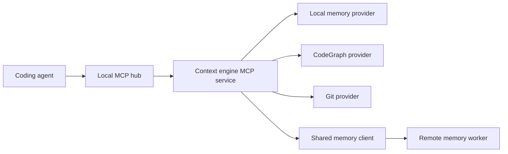

# Unified Context Engine Design

**Status:** Approved architecture

> **Parent:** [Phase 2 Memory Roadmap](2026-09-11-phase-2-memory-roadmap.md)  
> **Depends on:** [Shared Memory Foundation](2026-09-11-shared-memory-foundation-design.md)
> and [Local Repository Brain](2026-09-11-local-repository-brain-design.md)  
> **Plan:** [Unified Context Engine implementation plan](../plans/2026-09-11-unified-context-engine.md)

## Problem

Local memory, semantic memory, a code graph, and Git history each answer a
different class of question. Giving all raw results to an agent wastes context
and makes stale or weak evidence look equal to current source. Giving each
provider a large public tool surface also makes the agent choose retrieval
mechanics before it understands the task.

The unified context engine asks independent providers for candidates, combines
their ranked lists, preserves provenance and freshness, and returns a compact
context packet. It is a local orchestrator. It stores no facts and never changes
an authoritative source.

## Goals

1. Give a fresh agent a small project wake packet before it plans work.
2. Search component memory, code structure, Git evidence, and shared memory in
   one operation.
3. Explain a symbol, file, line range, or implementation decision with exact
   source and history evidence.
4. Respect explicit context budgets and report what was omitted.
5. Prefer current, specific, source-backed information without hiding genuine
   conflicts.
6. Degrade per provider so one unavailable dependency does not erase useful
   context from the others.
7. Expose a small, runtime-neutral MCP surface through the existing local hub.
8. Spend context progressively: tiny local identity first, focused evidence
   after a task, and detailed material only through explicit retrieval.
9. Avoid resending unchanged evidence or duplicating content between MCP text
   and structured response representations.

## Non-Goals

- Writing or mutating memory through the retrieval tools. Dedicated
  `brain_memory_propose`/`brain_memory_save` operations handle local Markdown;
  the existing `propose_memory`, `remember`, and `forget` contracts handle
  shared records.
- A model-based planner, query rewriter, summarizer, or reranker.
- Automatic transcript capture or mining.
- Persistent task state, diaries, handoffs, or multi-agent coordination.
- A temporal knowledge graph in this increment.
- Replacing direct code reads, tests, compilers, or the agent's judgment.
- Making a claim about intent when Git evidence does not contain one.

## Runtime Placement



The context engine is a TypeScript/Bun process on the engineer workstation. The
local hub launches it as a pinned `stdio_cmd` upstream and exposes it through
the hub's existing CodeMode transform. One process serves all local harnesses
and owns the embedded CodeGraph handles.

The engine uses the D26 local authentication client when it calls the shared
worker. It does not accept or forward an agent's inbound authorization header.
Upstream credentials remain on the workstation under D9/D10.

## Public MCP Surface

The recommended agent surface has four retrieval tools. They share these
context controls:

```typescript
type ContextControls = {
  maxTokens?: number;
  remainingContextTokens?: number;
  cursor?: string;
  responseFormat?: "markdown" | "structured";
};

type BrainWakeInput = ContextControls & {
  projectPath: string;
  level?: 0 | 1 | 2 | 3;
  task?: string;
};

type BrainSearchInput = ContextControls & {
  projectPath: string;
  query: string;
  sources?: Array<"local_memory" | "code" | "git" | "shared_memory">;
  limit?: number;
};

type BrainExplainInput = ContextControls & {
  projectPath: string;
  query?: string;
  symbol?: string;
  path?: string;
  startLine?: number;
  endLine?: number;
};

type BrainStatusInput = {
  projectPath: string;
};
```

- `brain_wake` provides identity, working-tree status, durable warnings and
  decisions, recent relevant activity, and retrieval handles.
- `brain_search` retrieves context for a natural-language task or question.
- `brain_explain` emphasizes current code relationships and Git history, then
  adds relevant memory.
- `brain_status` reports provider health, identity, freshness, and the last
  request's aggregate timing without returning content.

Low-level `local_memory_search`, `brain_memory_propose`, `brain_memory_save`,
`codegraph_explore`, `git_history`, `git_why`, and memory-worker tools remain
available through CodeMode execution for diagnosis, precise follow-up, and
explicit memory promotion. The base agent instructions tell agents to start
with `brain_*` and use a low-level operation when a packet identifies a specific
gap or a durable discovery is ready to save.

## Context Packet Contract

Every retrieval tool builds one internal packet. The MCP boundary returns its
content in exactly one representation:

```typescript
type ContextPacket = {
  schemaVersion: 1;
  packetId: string;
  cursor: string;
  mode: "wake" | "search" | "explain";
  request: {
    query?: string;
    task?: string;
    requestedLevel?: 0 | 1 | 2 | 3;
    requestedMaxTokens?: number;
    remainingContextTokens?: number;
    effectiveMaxTokens: number;
  };
  project: ProjectIdentity;
  freshness: {
    generatedAt: string;
    gitHead?: string;
    branch?: string;
    workingTree?: "clean" | "dirty";
    codeGraph: "missing" | "ready" | "pending" | "error";
    pendingFiles: string[];
    sharedRetrievedAt?: string;
  };
  items: ContextItem[];
  conflicts: ContextConflict[];
  degraded: ProviderFailure[];
  omitted: {
    candidates: number;
    estimatedTokens: number;
    reasons: Array<
      | "budget"
      | "duplicate"
      | "inactive"
      | "stale"
      | "provider_limit"
      | "item_cap"
      | "low_relevance"
      | "not_wake_eligible"
      | "already_delivered"
      | "cursor_reset"
    >;
  };
  estimatedTokens: number;
};

type ContextItem = {
  id: string;
  source: "local_memory" | "code" | "git" | "shared_memory";
  scope?: "component" | "system" | "domain" | "org";
  kind: string;
  title: string;
  excerpt: string;
  provenance: EvidenceRef[];
  freshness: "live" | "current_revision" | "historical" | "stale" | "unknown";
  channelRanks: Record<string, number>;
  fusedScore: number;
  authorityTier: number;
};
```

With the default `responseFormat: "markdown"`, MCP `content` contains the
rendered packet and `structuredContent` contains only `schemaVersion`,
`packetId`, `cursor`, `estimatedTokens`, omitted counts, degradation codes, and
evidence handles, plus conflict item IDs and resolution codes. It contains no
item title, excerpt, conflict reason, or other fact prose. With
`responseFormat: "structured"`, `structuredContent` contains the full packet
and MCP text contains only a fixed one-line packet ID/count summary. A client
therefore never injects the same fact twice. Neither representation includes
provider credentials, internal database identifiers, absolute workstation
paths, or raw provider errors.

## Evidence References

Every item has at least one navigable evidence reference:

```typescript
type EvidenceRef =
  | { kind: "local_memory"; path: ".agents/memory.md"; startLine: number; endLine: number; contentHash: string }
  | { kind: "code"; path: string; startLine: number; endLine: number; symbol?: string; graphState: string }
  | { kind: "git"; commit: string; path?: string; startLine?: number; endLine?: number }
  | { kind: "shared_memory"; memoryId: string; repository?: string; path?: string; commitSha?: string; heading?: string };
```

The formatter renders compact handles:

```text
local-memory://.agents/memory.md#L32
code://src/auth/token-service.ts#L81
git://3e11fc9?path=src/auth/token-service.ts
memory://018f5f5e-...
```

A generated observation cites the evidence items that support it. If there is
no evidence, it is not included.

## Query Planning

Planning is deterministic and uses no model. The engine tokenizes the request
and applies these signals:

| Signal | Providers |
|---|---|
| Search/explain | local memory unless the caller supplies another explicit source list |
| `why`, `history`, `changed`, commit hash, or line range | Git |
| symbol/path identifier, `calls`, `impact`, `flow`, `dependency`, or `test` | CodeGraph |
| `standard`, `convention`, `policy`, `platform`, `company`, `other service`, or explicit broader scope | Shared memory |
| Wake L0 | identity and Git status only |
| Wake L1, explicitly used for `continue`/orientation | bounded local purpose/warnings/decisions, three recent Git titles, at most three reviewed shared wake facts; CodeGraph status only |
| Wake L2/L3 with task | all relevant providers |
| Explain | CodeGraph and Git always; local/shared memory when identity permits |

An explicit `sources` list wins over automatic routing. The engine records the
selected providers in diagnostics.

The query sent to shared memory contains only the original natural-language
query or task, clipped to 2,000 Unicode code points. The engine does not append
source code, CodeGraph output, diffs, local memory text, or absolute paths. If
the request contains a fenced code block, high-entropy token, or a credential
scanner match, shared retrieval is skipped and reported as locally restricted.

## Parallel Retrieval

Selected providers run concurrently with individual deadlines:

| Provider | Default deadline | Candidate cap |
|---|---:|---:|
| Local memory | 100 ms | 10 |
| CodeGraph | 1,200 ms | 12 |
| Git | 1,200 ms | 10 |
| Shared memory | 800 ms | 6 for task queries; 3 for L1 wake |

The normal aggregate deadline is 1,500 ms for search/explain and 750 ms for
L1 wake. L2/L3 may use 2,500 ms. A provider timeout produces a structured
degradation entry; it does not cancel results already returned by another
provider.

The engine uses an `AbortSignal` for every provider. Late responses are ignored
and cannot mutate the packet after formatting.

## Ranking and Fusion

Each provider returns an ordered candidate list. The engine never adds raw
vector similarity, BM25, graph distance, and recency because their scales are
unrelated.

It applies weighted reciprocal-rank fusion:

```text
rrf(candidate) = Σ channelWeight / (60 + rankInChannel)
```

Initial channel weights are:

| Channel | Weight |
|---|---:|
| Exact symbol/path/code relationship | 1.40 |
| Local component-memory BM25/exact | 1.25 |
| Git blame/exact hash | 1.25 |
| Git history BM25/recent path | 1.10 |
| Shared semantic | 1.00 |
| Shared lexical | 1.00 |

Deterministic tie-breaks, in order:

1. exact identifier/path/hash match;
2. higher authority tier;
3. more specific applicable scope;
4. newer authoritative revision;
5. stable item ID.

Authority tiers are:

| Tier | Evidence |
|---:|---|
| 100 | Current source/config/schema returned from the current checkout |
| 90 | Current CodeGraph relationship with no pending-file warning |
| 80 | Accepted ADR or reviewed Git knowledge at its current revision |
| 70 | Merged Git commit, diff, or blame evidence |
| 60 | Human-authored component memory |
| 50 | Confirmed system memory with provenance |
| 40 | Older or weakly sourced memory |

Authority breaks close relevance ties and resolves explicit identity conflicts;
it does not make unrelated source code outrank a directly relevant domain rule.

## Deduplication

Deduplication proceeds in this order:

1. Same provider ID: keep the highest-ranked instance and merge channel ranks.
2. Same evidence locator and content hash: merge provenance.
3. Same normalized content across scopes: keep the most specific applicable
   scope and retain all source references.
4. Same memory identity with an explicit supersession link: drop the inactive
   record and record `superseded` in `omitted`.

The engine does not use semantic similarity alone to remove a candidate. Two
similar statements from different authoritative sources may disagree and must
remain visible.

## Context Cursor and Repeat Suppression

Each packet returns a random opaque cursor. The local process keeps an LRU entry
for that cursor containing at most 256 `(itemId, contentHash)` pairs. It stores
no query, excerpt, source code, memory text, file path, or user identifier. The
cache holds at most 128 cursors and expires each cursor four hours after its last
use; process restart clears all cursors.

When a request supplies a valid cursor, an item with the same ID and content
hash is omitted as `already_delivered`. A changed hash is new evidence and may
be returned. Required degradation notices and a newly detected conflict remain
eligible even when one referenced item was seen. An unknown or expired cursor
starts a new delivery set and reports `cursor_reset` without failing retrieval.

The returned cursor replaces the input cursor and represents the union of
previously delivered evidence plus the current packet. A new chat begins with
no cursor. This is delivery deduplication only; it never changes ranking,
authority, or an underlying memory record.

## Conflict Handling

Conflicts are detected only from stable keys and explicit evidence:

- two active memories with the same `identityKey` and different canonical
  values;
- a memory whose cited source commit is older than the current revision of the
  same Git source;
- local and shared memory with the same stable identity but different values;
- a memory statement tied to a file/symbol whose cited content hash no longer
  matches the current checkout.

The engine does not attempt open-ended natural-language contradiction detection
without a model. It returns both records and a conflict object:

```typescript
type ContextConflict = {
  identityKey: string;
  itemIds: string[];
  resolution: "current_source_preferred" | "reviewed_source_preferred" | "unresolved";
  reason: string;
};
```

Current source wins for what code does now. Current reviewed Git knowledge wins
over an older derived revision. A human-authored component rule wins over a
broader system convention only for that component. Unresolved conflicts are
shown prominently and never merged into one statement.

## Context Budgets

Budgets are model-independent estimates, calculated conservatively as
`ceil(Unicode code points / 3)`. The packet labels the value
`estimatedTokens`; it does not claim an exact tokenizer count. The estimate and
mode cap cover the complete model-visible MCP result: text plus structured
content for the selected response format. Compact metadata is therefore part of
the budget even though fact prose appears in only one representation.

| Mode | Default target | Hard maximum | Content |
|---|---:|---:|---|
| Wake L0 | 100 | 150 | Identity, branch, HEAD, dirty state, provider state; no retrieved items |
| Wake L1 | 350 | 500 | Explicit continuation/orientation with bounded local facts, Git titles, and reviewed shared wake facts |
| Wake L2 | 800 | 1,500 | Task-specific memory, code, Git, and shared context |
| Wake L3 | 3,000 | 5,000 | Explicit deep briefing with more evidence |
| Search | 800 | 1,500 | At most six ranked results for a query |
| Explain | 1,200 | 2,500 | Focused code flow, historical evidence, and relevant rules |

Caller `maxTokens` may lower the target or raise it only to the hard maximum.
When the caller provides `remainingContextTokens`, the effective maximum is also
capped at five percent of that value. When it provides neither field, the
default target applies. The entire serialized response is capped at 16 KiB.

Independent item limits prevent a collection of tiny records from becoming a
large prompt:

| Mode | Item limits |
|---|---|
| L0 | zero retrieved items |
| L1 | two local memory items, three Git titles, three shared wake facts; shared excerpts use at most 200 tokens total |
| L2 | six items total and at most three shared items |
| L3 | twenty items total and at most eight shared items |
| Search | six items by default; caller may lower the limit |
| Explain | eight items total |

Selection reserves space before filling by rank:

1. identity/freshness and degradation notices;
2. unresolved conflicts and warnings;
3. exact code/Git evidence requested by path, symbol, line, or hash;
4. ranked context items;
5. retrieval handles and omitted counts.

An item may be clipped only at paragraph or code-block boundaries. Its evidence
reference and `[content clipped]` marker remain. The engine never clips a commit
hash, path, line range, status, or warning label.

## Wake Behavior

`brain_wake` is ephemeral. It does not write `wake-context.md` or alter memory.

### L0

Return repository/component identity, branch, HEAD, dirty state, and compact
configured/unknown provider state. Return no memory body, Git list, code
snippet, or shared-memory content. This level makes no network request and is
the only automatic new-chat injection.

### L1

L1 is used when the developer asks to continue or explicitly requests project
orientation without a concrete task. Return L0 plus at most two local purpose,
warning, or decision items; three recent Git titles without bodies/diffs; up to
three high-confidence, unexpired shared records marked `wake: true`; and
CodeGraph status. Shared excerpts consume at most 200 tokens. L1 does not
request full CodeGraph source or ordinary shared search results.

### L2

Requires a non-empty `task`. It plans providers from the task and returns at
most six combined items, including no more than three shared records. A shared
candidate must have high confidence and pass the task relevance threshold.
Ordinary shared facts below the threshold remain available through explicit
`brain_search`.

### L3

Requires a task and is explicitly requested. It increases candidate and context
budgets but keeps all privacy, evidence, and timeout rules.

The broader blueprint's exact session continuation needs durable task state.
That state is deliberately absent here because D29 keeps one committed component
memory file and M9 bans transcript mining. L1/L2 still provide strong continuity
from durable memory, the current working tree, recent Git activity, and an
explicit task. Persistent current-task files require a later approved design.

## Agent Instructions and Lifecycle

The base instructions gain this short protocol:

```markdown
## Project context

- At the start of a new chat in a repository, call `brain_wake` at L0. If a
  concrete task is already known, call L2 directly instead.
- Use L1 only when the developer asks to continue or requests orientation. Use
  L2 with the concrete task for normal work. L3 requires an explicit request.
- Pass the latest context cursor to later calls so unchanged evidence is not
  repeated. Follow an evidence handle when more detail is needed.
- Before a non-trivial architecture change, use `brain_explain` for the affected
  symbol or path and inspect its Git evidence.
- Treat current source as the authority for current behavior. Follow every
  memory claim to its provenance when it affects a risky change.
- When the developer explicitly says to remember something, distill only the
  durable component fact, attach evidence, and use `brain_memory_propose`
  followed by `brain_memory_save`. Return the applied Markdown diff.
- At task completion or before compaction, you may suggest a durable local
  memory as a `brain_memory_propose` diff. Do not call `brain_memory_save` for
  an agent-originated suggestion until the developer says save, remember, or
  promote.
- Propose system memory only after the engineer confirms promotion. Never save
  transcripts, secrets, speculation, or temporary task state as durable memory.
```

Harnesses that support a session-start hook may call L0 automatically after the
MCP connection is ready. They never call L1/L2/L3 until the triggering user
intent is known. Other harnesses follow the base instruction. A
pre-compaction hook may remind the agent to propose verified durable facts. It
must not capture, persist, or upload the transcript, and it cannot promote a
proposal without an explicit developer instruction.

## Shared Memory Client

The shared client uses the memory worker contract rather than MemPalace:

```typescript
type SharedMemoryClient = {
  search(input: MemorySearchInput, signal: AbortSignal): Promise<SharedMemorySearchResult>;
  wake(input: MemoryWakeInput, signal: AbortSignal): Promise<SharedMemoryWakeResult>;
  status(signal: AbortSignal): Promise<SharedMemoryStatus>;
};
```

It obtains a D26 session token through the shared authentication client, caches
it until one minute before expiry, and retries once after an authentication
failure. It validates response schema before candidates enter ranking.

The client sends only:

- the clipped natural-language query;
- component-resolved system and domain names;
- explicit scope filters;
- result limit and request correlation ID.

For L1 it sends no query. It sends `purpose: "wake"`, the resolved cascade, a
limit no greater than three, and the correlation ID. L0 never constructs a
shared request.

It never sends local-memory content, CodeGraph content, Git output, code snippets,
absolute paths, branch diffs, or working-tree state.

## Formatting

The Markdown packet follows one stable order:

```markdown
# Project Context

## Identity and freshness
## Warnings and conflicts
## Current code
## Why and history
## Component memory
## Shared context
## Degraded sources
## Retrieval handles
```

Empty sections are omitted. Each bullet begins with a concise title and ends
with one or more evidence handles. Provider scores and internal timing appear
only in structured content or debug mode.

The formatter produces one representation per request. Markdown mode returns
the headings above plus compact metadata-only `structuredContent`. Structured
mode returns `ContextPacket` with excerpts plus a one-line text acknowledgment.
No response contains the same title or excerpt in both places. Excerpts end at
a paragraph boundary and use the item limits and budgets above; a handle is
returned even when its supporting text is clipped.

The formatter does not generate new summaries. It may select a title already
provided by the source, clip content, and add fixed labels. A future model-based
summary/rerank stage would require an explicit opt-in design and must retain the
same structured evidence packet.

## Status and Diagnostics

`brain_status` returns:

- project/component/system/domain identity;
- local memory presence, size, hash, and section count;
- CodeGraph version, state, pending-file count, and open-handle count;
- Git HEAD, branch/detached state, dirty flag, and shallow flag;
- shared worker reachability, provider state, catalog age, and index backlog;
- configured deadlines and budgets;
- process uptime and version.

It contains no memory text, query text, commit body, source snippet, credential,
DSN, absolute path, or session token.

## Failure Behavior

| Failure | Packet behavior |
|---|---|
| Component declaration missing | Local providers run; shared cascade is org-only; warning explains how to declare the component. |
| Local memory missing/invalid | Omit component memory; include provider failure; code and Git continue. |
| CodeGraph missing/pending | Omit or mark stale code items; Git/local/shared continue; include initialization/read-live guidance. |
| Git unavailable/timeout | Omit history; never describe memory as Git evidence. |
| Shared auth/service timeout | Omit shared items; local packet remains valid. |
| Shared response invalid | Reject that provider response and record a schema error without raw payload. |
| Overall deadline reached | Format completed candidates and list timed-out providers. |
| Budget exhausted | Preserve required notices/evidence and report omitted counts. |
| Formatter error | Return structured items with a short fixed fallback rendering. |
| Cursor unknown/expired | Start a new delivery set, mark `cursor_reset`, and continue. |
| All shared task hits below relevance threshold | Omit shared content and report `low_relevance`; local providers continue. |

No provider failure silently converts `unknown` freshness into `current`.

## Privacy and Logging

- The process binds through stdio or loopback only.
- Logs contain correlation IDs, provider names, durations, candidate counts,
  budget counts, and error classes.
- Logs never contain user queries, source code, local-memory content, commit
  bodies, filenames from private paths, shared-memory text, credentials, or
  environment values.
- Provider errors are mapped to stable error codes before logging or returning.
- Telemetry is disabled by default. Enabling aggregate metrics cannot enable
  CodeGraph telemetry or content collection implicitly.

## Evaluation and Test Strategy

### Deterministic tests

1. Query-planner tables prove source selection for wake/search/explain inputs.
2. Fusion tests prove RRF ordering without comparing raw provider scores.
3. Deduplication tests preserve provenance across duplicate channels.
4. Conflict tests prove current-source/reviewed-source rules and unresolved
   output.
5. Budget tests preserve warnings, exact evidence, and handles while clipping
   lower-ranked prose.
6. Cursor tests prove unchanged evidence is not delivered twice, changed hashes
   are delivered, expiry resets safely, and cursor state contains no content.
7. Representation tests prove fact text appears once in both Markdown and
   structured modes.
8. Timeout tests use controllable provider clocks and prove late results cannot
   mutate a packet.
9. Privacy tests assert logs and shared requests contain no local provider
   payload.
10. MCP schema snapshots protect the four public tool contracts.

### Retrieval evaluation

Create a committed evaluation fixture with at least 50 questions across pilot
repositories. Each question names acceptable evidence IDs, source types, and
whether a stale/conflicting item must be reported. The fixture contains only
synthetic or approved public code and knowledge.

Release thresholds:

- evidence recall at 5 at least 0.85 overall;
- exact path/symbol/hash evidence recall at 5 of 1.00;
- provenance present and resolvable for 100% of returned items;
- required conflict detection precision and recall of 1.00 on explicit-key
  fixtures;
- zero local-content bytes in captured shared requests except the original
  clipped natural-language query;
- L0 packet at or below 150 estimated tokens in 100% of fixtures and zero
  shared/code/memory retrieval calls;
- L1 packet at or below 500 estimated tokens in 100% of fixtures, with no more
  than three shared facts and no more than 200 shared-context tokens;
- L2 packet at or below 1,500 estimated tokens and six items in 100% of
  fixtures;
- repeated retrieval with a cursor returns zero unchanged fact excerpts;
- every MCP result contains each returned fact's prose in one representation;
- graceful-degradation scenarios return at least one healthy-provider item when
  such an item exists.

Threshold changes require updating the fixture rationale and reviewing the
ranking decision, not merely changing a number to make CI pass.

## Acceptance Criteria

1. A fresh agent receives only an L0 identity/status envelope of at most 150
   estimated tokens and makes no memory, CodeGraph-content, or network request.
2. `brain_search` combines relevant local memory, current code, Git evidence,
   and system/domain/org memory without adding raw provider scores.
3. `brain_explain` for a symbol or line range returns current source location,
   graph relationships, and evidence-bearing commits when available.
4. A stale graph, missing shared worker, or Git timeout is visible but does not
   discard healthy results.
5. An old memory never silently overrides current source or a current reviewed
   Git publication.
6. Every statement in the packet has a local path/line, commit, or shared-memory
   provenance handle.
7. Retrieval operations write no durable fact and store no transcript;
   dedicated local-memory operations follow the proposal, promotion, and
   content-hash rules in the Local Repository Brain design.
8. No code, graph data, Git output, local memory, or working-tree state is sent
   to the shared worker.
9. The evaluation gates and the full repository checks pass with the pinned
   provider versions.
10. A chat-derived suggestion remains an ephemeral diff until explicit
    promotion, while an explicit “remember this” request can save the distilled
    entry and return the applied diff without a redundant confirmation round.
11. L1 includes at most three active, high-confidence, unexpired shared records
    marked `wake: true`; agent-originated records cannot mark themselves for
    automatic delivery.
12. L2 and default search include at most three shared facts and omit low
    relevance shared results.
13. Supplying the returned cursor prevents unchanged evidence from consuming
    context again, while changed evidence remains visible.
14. Default MCP responses contain returned prose once, and every mode respects
    both its token and item cap.
